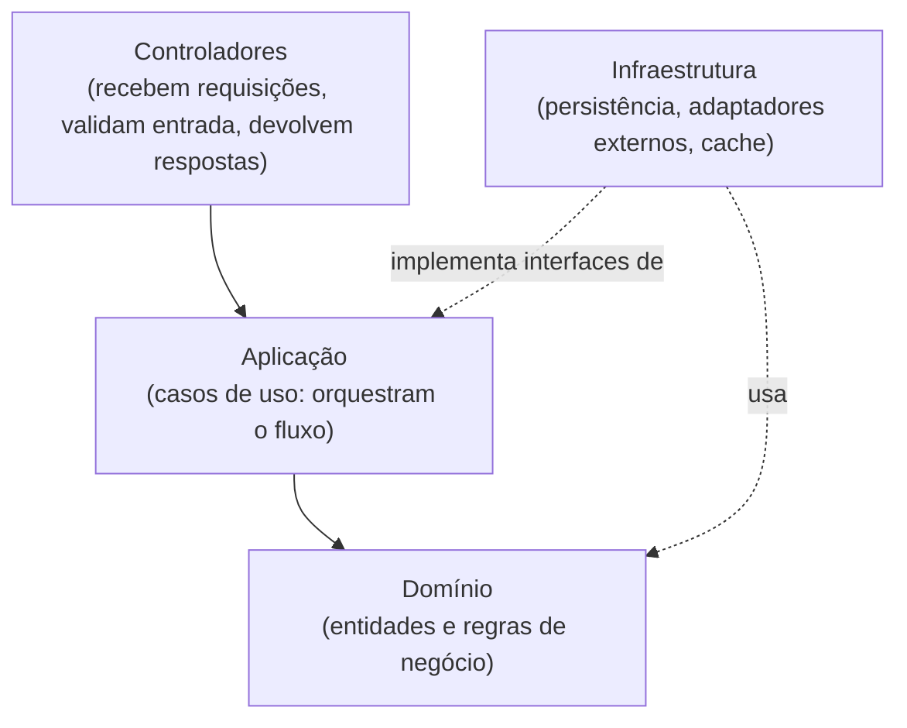

# DA02 — Camadas e padrão MVC

| Campo | Valor |
|---|---|
| Status | Aceita |
| Data | 24/09/2026 |
| Drivers | QA08, QA10 |
| Relacionadas | [DA10](DA10-nucleo-calculo-puro.md) |

## Contexto

Regras de negócio precisam ser testáveis sem interface nem banco (QA10) e a troca de fonte de dados não pode afetar as regras (QA08).

## Alternativas consideradas

1. **Código sem separação de responsabilidades** — rotas acessando o banco e as APIs diretamente. Mais rápido de começar, mas impede testes isolados e espalha regras.
2. **Camadas com dependências apontando para dentro**, organizadas segundo o padrão MVC.

## Decisão

Alternativa 2. Cada módulo do servidor é organizado em quatro camadas:

| Papel MVC | No servidor | No cliente |
|---|---|---|
| **Model** | Domínio + infraestrutura (entidades, regras, repositórios) | Estado local e cache |
| **View** | Representação dos dados enviada ao cliente | Telas e componentes visuais |
| **Controller** | Controladores de cada módulo | Lógica de tela que trata ações do usuário e chama o servidor |

## Consequências

- (+) O domínio não conhece banco, rede nem interface: pode ser testado isoladamente.
- (+) Trocar banco ou provedor externo altera apenas a camada de infraestrutura.
- (−) Mais arquivos e interfaces do que um código "direto"; aceitável pelo ganho em testabilidade.
