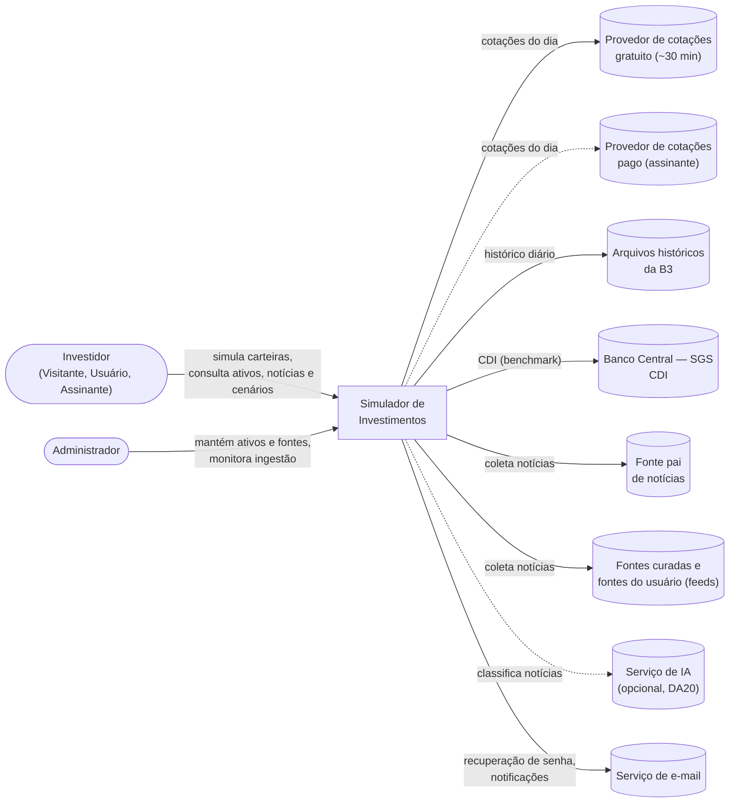
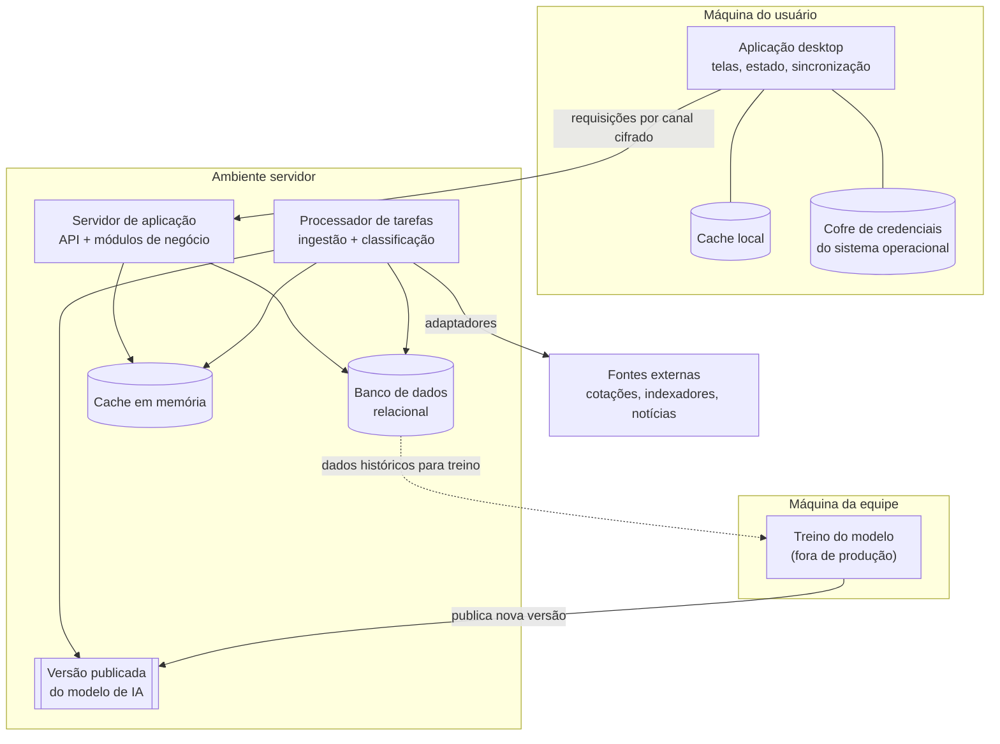
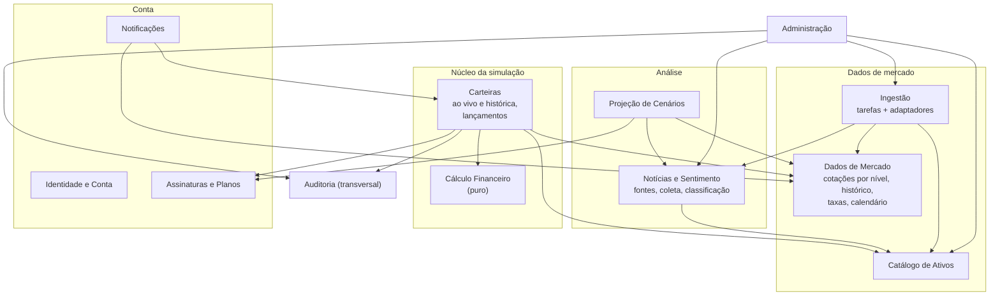
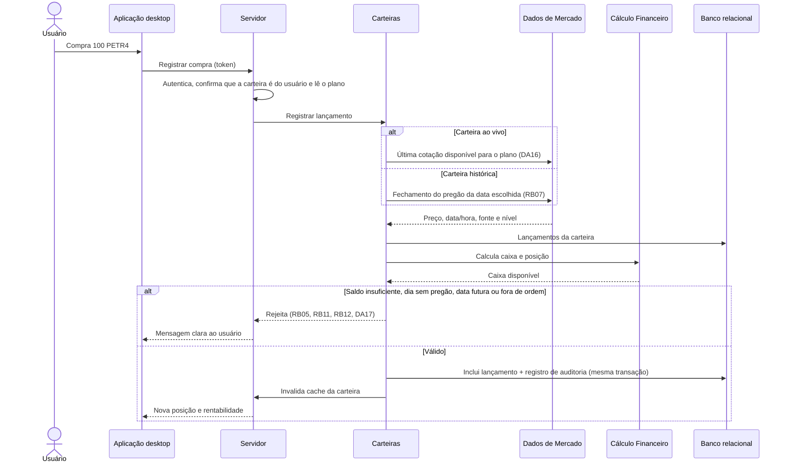
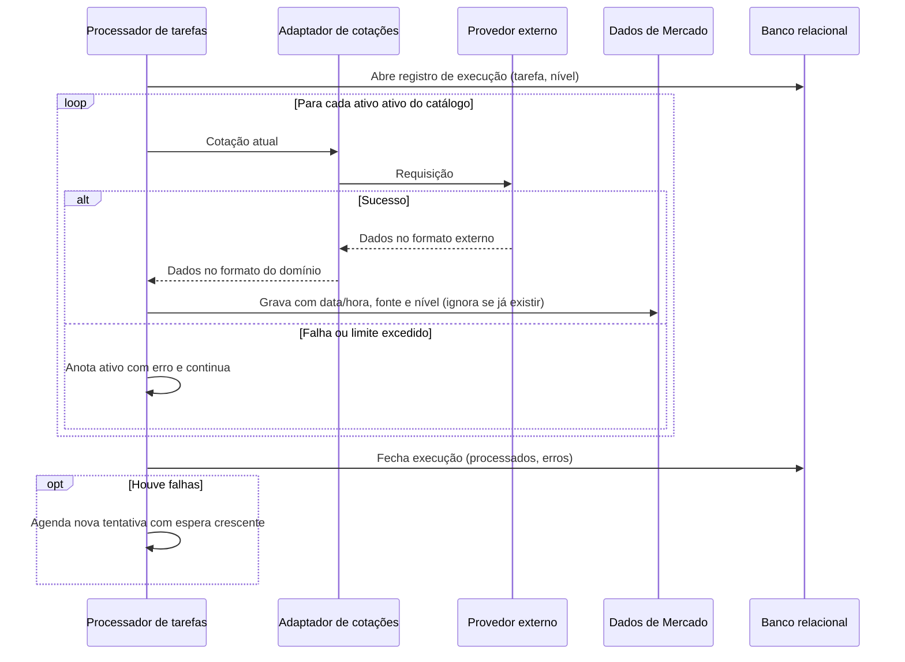
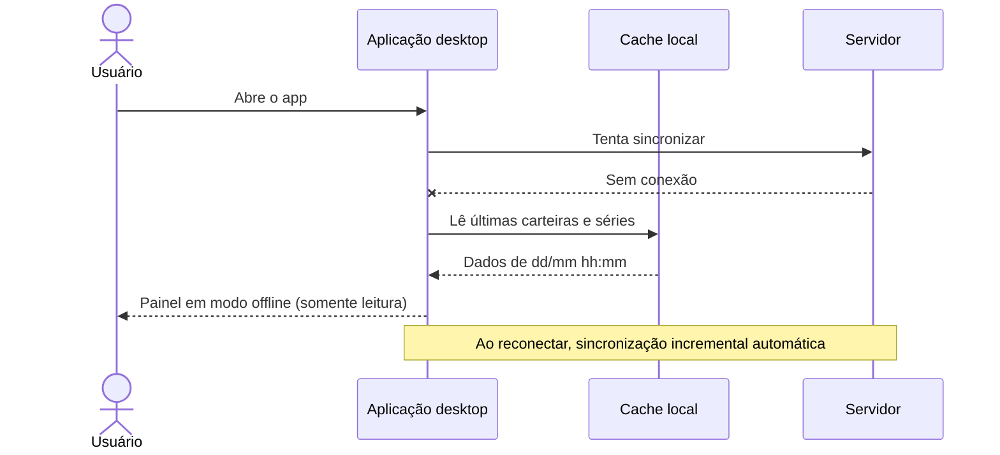
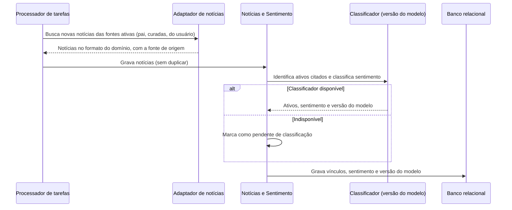
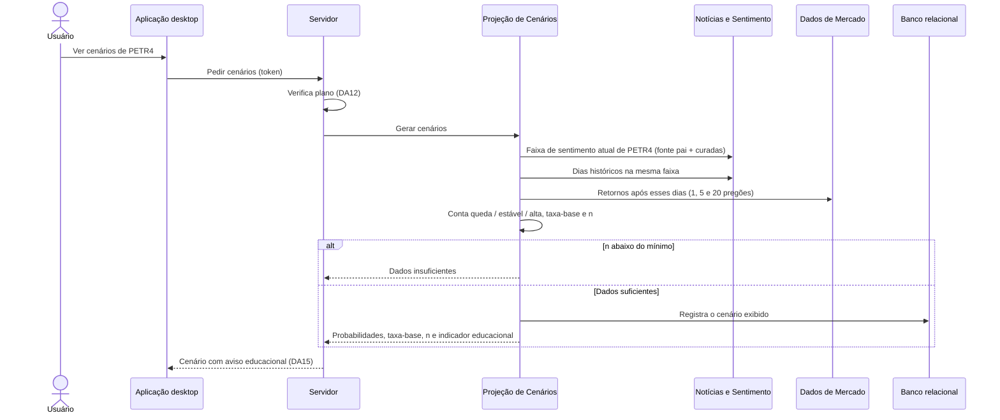
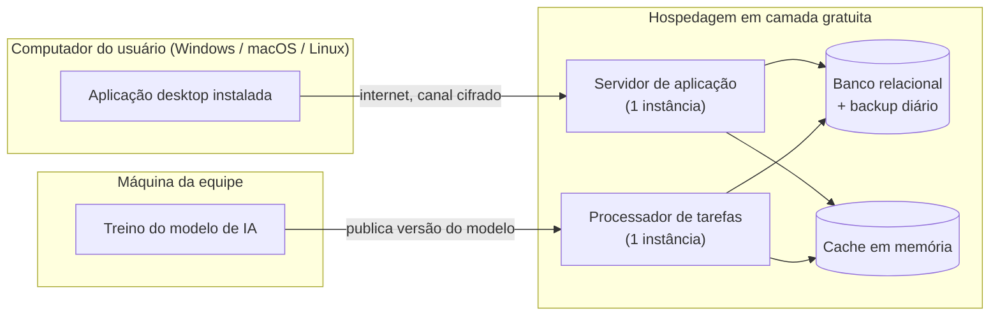

# Documento de Arquitetura

**Projeto:** Simulador de Investimentos
**Universidade Presbiteriana Mackenzie** — Engenharia da Computação
**Integrantes:** Luís Gustavo Sampaio Coêlho, Nicoly Araujo de Paschoa
**Versão:** 2.2

| Versão | Data | Alteração |
|---|---|---|
| 1.0 | 24/09/2026 | Primeira versão, com as decisões DA01–DA15 no corpo do documento |
| 2.0 | 01/10/2026 | Decisões movidas para [ADRs](adr/README.md); novas decisões DA16–DA21 (cotações por plano, carteira histórica, histórico da B3, fontes de notícias, modelo de IA, cenários por sentimento); ligação com [Decisões Técnicas](decisoes_tecnicas.md) |
| 2.1 | 02/10/2026 | Escopo inicial restrito a ações e FIIs; renda fixa adiada e movida para pontos de extensão ([DA22](adr/DA22-escopo-acoes-fiis-renda-fixa-adiada.md)) |
| 2.2 | 08/10/2026 | Classes de ativo Ação e FII, com setor e segmento ([DA23](adr/DA23-classes-de-ativo-acoes-e-fiis.md)); PE14 e PE15 resolvidas |

---

## 1. Introdução

### 1.1 Objetivo

Este documento consolida a arquitetura de **alto nível** do Simulador de Investimentos: como o sistema se divide, como as partes se comunicam e quais decisões estruturais foram tomadas.

É o ponto de entrada da documentação de arquitetura:

- **por que** o sistema é assim → [Drivers Arquiteturais](drivers_arquiteturais.md);
- **cada decisão em detalhe**, com alternativas e consequências → [ADRs](adr/README.md);
- **com quais tecnologias** → [Decisões Técnicas](decisoes_tecnicas.md).

O documento é **independente de tecnologia**: fala em "banco de dados relacional", "cache em memória" e "aplicação desktop", não em produtos específicos.

### 1.2 Documentos relacionados

| Documento | Conteúdo |
|---|---|
| [Visão de produto](Visão%20de%20produto.md) | Visão, problema, público e evolução do produto |
| [Personas](personas.md) | Perfis de usuário |
| [Especificação de Requisitos](requisições.md) | Requisitos funcionais, não funcionais e regras de negócio |
| [Modelo de Domínio](modelo_dominio.md) | Entidades e relacionamentos |
| [Casos de Uso](modelo_casos_de_uso.md) | Diagrama de casos de uso |
| [Drivers Arquiteturais](drivers_arquiteturais.md) | Objetivos, atributos de qualidade, restrições e premissas |
| [ADRs](adr/README.md) | Registro de cada decisão arquitetural |
| [Decisões Técnicas](decisoes_tecnicas.md) | Tecnologias, bibliotecas, serviços e fontes de dados |

### 1.3 Convenções

- **DAxx** — decisão arquitetural, registrada em [adr/](adr/README.md)
- **OBJ, FAS, QA, RES, PRE, PA** — drivers definidos em [drivers_arquiteturais.md](drivers_arquiteturais.md)
- **RF, RNF, RB** — requisitos e regras de negócio definidos em [requisições.md](requisições.md)
- **PEx** — ponto em aberto (seção 13)

---

## 2. Visão geral

O sistema é uma aplicação **cliente-servidor**:

- Um **cliente desktop** instalado na máquina do usuário, responsável pelas telas, pela experiência de uso e por um cache local para consulta sem conexão.
- Um **servidor central**, que é a **fonte da verdade**: guarda os dados, aplica todas as regras de negócio e é o único que conversa com as fontes externas.
- Um **processador de tarefas em segundo plano**, que coleta cotações de ações e FIIs (inclusive durante o pregão), a série do CDI e notícias, e classifica as notícias com o modelo de IA, sem depender de o usuário estar usando o app.

O servidor é um **monólito modular**: uma única aplicação implantável, dividida internamente em módulos com fronteiras claras, cada um organizado em **camadas**.

O escopo atual cobre **ações e fundos imobiliários (FIIs)** negociados na B3; a renda fixa foi adiada para uma fase futura ([DA22](adr/DA22-escopo-acoes-fiis-renda-fixa-adiada.md), seção 11).

O usuário simula investimentos em dois tipos de carteira:

- **ao vivo** — compra e vende agora, com a cotação mais recente disponível para o seu plano;
- **histórica** — monta a carteira no passado e vê como ela teria evoluído até hoje.

Sobre essas carteiras, o sistema mostra notícias relacionadas e **cenários** calculados a partir do sentimento das notícias, sempre com caráter educacional.

---

## 3. Decisões arquiteturais

Cada decisão está registrada como ADR, com contexto, alternativas, decisão, consequências e pontos em aberto.

| ID | Tema | Decisão | Alternativa descartada | Status |
|---|---|---|---|---|
| [DA01](adr/DA01-cliente-servidor-monolito-modular.md) | Estilo geral | Cliente-servidor, servidor como fonte da verdade, monólito modular | App 100% local; microsserviços | Aceita |
| [DA02](adr/DA02-camadas-mvc.md) | Organização interna | Camadas + padrão MVC | Código sem separação de responsabilidades | Aceita |
| [DA03](adr/DA03-cliente-desktop-multiplataforma.md) | Cliente | Desktop multiplataforma, uma base de código | App web; um app nativo por SO | Aceita |
| [DA04](adr/DA04-banco-relacional.md) | Banco de dados | Relacional | NoSQL; híbrido | Aceita |
| [DA05](adr/DA05-autenticacao-propria.md) | Autenticação | Própria (e-mail e senha), login via Google como evolução | Somente login externo | Aceita |
| [DA06](adr/DA06-adaptadores-fontes-externas.md) | Fontes externas | Adaptadores, acessados só pelo servidor | Chamadas diretas às APIs | Aceita |
| [DA07](adr/DA07-ingestao-assincrona.md) | Ingestão | Assíncrona, agendada, centralizada | Busca sob demanda | Aceita (alterada por DA16, DA18) |
| [DA08](adr/DA08-cache-dois-niveis-offline-leitura.md) | Cache e offline | Cache em dois níveis; offline somente leitura | Edição offline | Aceita |
| [DA09](adr/DA09-lancamentos-imutaveis.md) | Transações | Lançamentos imutáveis; posição sempre calculada | Tabela de posição editável | Aceita |
| [DA10](adr/DA10-nucleo-calculo-puro.md) | Cálculo financeiro | Núcleo puro e isolado | Regras espalhadas | Aceita |
| [DA11](adr/DA11-noticias-ia-modulo-isolado.md) | Notícias e IA | Módulo isolado, fora do caminho crítico | Classificação na requisição do usuário | Aceita (complementada por DA19, DA20) |
| [DA12](adr/DA12-autorizacao-planos-no-servidor.md) | Autorização | Perfis, propriedade e plano verificados no servidor | Controle apenas na interface | Aceita |
| [DA13](adr/DA13-dados-pessoais-concentrados.md) | Privacidade | Dados pessoais concentrados no módulo de identidade | Dados pessoais espalhados | Aceita |
| [DA14](adr/DA14-registro-execucoes-logs.md) | Observabilidade | Registro de execuções no banco + logs estruturados | Só logs em texto; ferramenta paga | Aceita |
| [DA15](adr/DA15-carater-educacional.md) | Conformidade | Indicador educacional obrigatório nas respostas | Aviso fixo em cada tela | Aceita |
| [DA16](adr/DA16-cotacoes-por-plano.md) | Cotações | Durante o pregão: ~30 min no gratuito, provedor pago no assinante | Só fechamento; tempo real licenciado | Aceita, com pontos em aberto |
| [DA17](adr/DA17-carteira-ao-vivo-e-historica.md) | Tipos de carteira | Carteira ao vivo e carteira histórica, tipo imutável | Datas passadas em qualquer carteira | Aceita, com pontos em aberto |
| [DA18](adr/DA18-historico-cotacoes-arquivos-b3.md) | Histórico de cotações | Arquivos públicos da B3 + brapi para o dia | Plano pago; fontes não oficiais | Proposta |
| [DA19](adr/DA19-fontes-de-noticias.md) | Fontes de notícias | Fonte pai fixa + curadas + do usuário, com prioridade | Só fontes da equipe; livre escolha | Aceita, com ponto crítico |
| [DA20](adr/DA20-modelo-ia-noticias.md) | Modelo de IA | Modelo versionado, treinado fora do servidor com janela histórica | Regras de palavras; só API externa | Aceita, com pontos em aberto |
| [DA21](adr/DA21-cenarios-por-sentimento.md) | Cenários | Probabilidade condicional ao sentimento, com taxa-base e n | Peso fixo; modelo preditivo caixa-preta | Proposta |
| [DA22](adr/DA22-escopo-acoes-fiis-renda-fixa-adiada.md) | Escopo inicial | Ações e FIIs; renda fixa adiada | Renda fixa no escopo inicial; só ações | Aceita, com pontos em aberto |
| [DA23](adr/DA23-classes-de-ativo-acoes-e-fiis.md) | Classes de ativo | Ação (inclui units) e FII, com setor e segmento; ETFs e BDRs fora | Tipo deduzido do ticker; classe em texto livre | Aceita |

---

## 4. Visão de contexto

Mostra o sistema como uma caixa e quem interage com ele.

---

## 5. Visão de contêineres

Mostra as partes executáveis e os armazenamentos de dados.

| Contêiner | Responsabilidade |
|---|---|
| Aplicação desktop | Interface, controle de telas, cache local, sincronização incremental, guarda de tokens no cofre do SO; consulta periódica das cotações enquanto a tela está aberta |
| Servidor de aplicação | Recebe requisições, autentica, autoriza (perfil, propriedade e plano), executa casos de uso, aplica regras de negócio |
| Processador de tarefas | Executa ingestão e classificação de forma agendada; compartilha o código dos módulos com o servidor, mas roda como processo separado |
| Banco de dados relacional | Fonte da verdade de todos os dados persistentes |
| Cache em memória | Cotações recentes e resultados de cálculo; descartável (pode ser recriado a partir do banco) |
| Versão publicada do modelo de IA | Modelo usado pelo processador para classificar notícias; cada versão é identificada ([DA20](adr/DA20-modelo-ia-noticias.md)) |
| Treino do modelo | Aperfeiçoamento do modelo com a janela histórica, feito pela equipe fora do ambiente de produção |

O servidor de aplicação e o processador de tarefas usam **o mesmo código** (mesmo monólito modular), apenas iniciado em dois modos diferentes. Assim, se a ingestão travar, as requisições dos usuários continuam sendo atendidas.

### 5.1 Tarefas do processador

| Tarefa | Frequência | Decisão |
|---|---|---|
| Cotações durante o pregão — nível gratuito | A cada ~30 min, só em horário de pregão | DA16 |
| Cotações durante o pregão — nível assinante | Conforme o provedor pago (5–15 min) | DA16 |
| Fechamento do dia | Após o fechamento do pregão | DA07 |
| Carga retroativa de ativo novo | Sob demanda, a partir dos arquivos da B3 | DA18 |
| CDI | Diária | DA07 |
| Calendário de pregão | Anual, com revisão manual | DA07 |
| Coleta de notícias | Algumas vezes ao dia, por fonte (pai, curadas, do usuário) | DA19 |
| Classificação e vínculo das notícias | Logo após cada coleta | DA20 |
| Sentimento diário por ativo | Após o fechamento do pregão | DA21 |

*Fase de renda fixa (DA22):* Selic e IPCA, preços do Tesouro Direto e feriados bancários entram como novas tarefas.

---

## 6. Visão de módulos

### 6.1 Módulos do servidor

| Módulo | Responsabilidade | Requisitos | Decisões |
|---|---|---|---|
| Identidade e Conta | Cadastro, login, sessão, recuperação de senha, perfil, consentimento, exportação e exclusão de dados | RF01–RF06 | DA05, DA13 |
| Assinaturas e Planos | Planos, assinatura com pagamento simulado, verificação de acesso a recursos premium e ao nível de cotação | RF32, RF33 | DA12, DA16 |
| Catálogo de Ativos | Ativos por classe (Ação, FII), setores das ações, segmentos dos FIIs, busca | RF07, RF39 | DA22, DA23 |
| Dados de Mercado | Cotações durante o pregão (por nível) e de fechamento, histórico, série do CDI, calendário de pregão; consultas de séries | RF08–RF10 | DA16, DA18 |
| Ingestão | Agendamento, execução e registro das tarefas; adaptadores das fontes externas | RF09, RF10, RF26, RF40 | DA06, DA07, DA14 |
| Carteiras | Carteiras ao vivo e históricas, lançamentos (compra, venda, aporte, retirada, estorno), validação das regras de lançamento, comparação e simulações salvas | RF11–RF13, RF17–RF22 | DA09, DA17 |
| Cálculo Financeiro | Posição, preço médio, rentabilidade, benchmarks | RF14–RF16 | DA10 |
| Notícias e Sentimento | Fontes (pai, curadas, do usuário) e preferências; coleta; vínculo notícia–ativo; classificação pelo modelo de IA; sentimento diário por ativo | RF26–RF29 | DA11, DA19, DA20 |
| Projeção de Cenários | Cenários por probabilidade condicional ao sentimento, com taxa-base e n; registro dos cenários exibidos | RF30, RF31 | DA15, DA21 |
| Notificações | Variação relevante | RF35 | — |
| Administração | Manutenção de ativos e fontes curadas, painel de execuções, reexecução de tarefas | RF39, RF40 | DA14 |
| Auditoria | Registro de operações sobre transações e ações administrativas | RNF15 | DA09 |

**Regra de dependência:** um módulo usa outro apenas pela sua interface pública. O módulo **Cálculo Financeiro** não depende de nenhum outro. Os módulos de **Análise** dependem do núcleo e dos dados de mercado, mas o núcleo **não** depende deles.

### 6.2 Módulos do cliente

| Módulo | Responsabilidade |
|---|---|
| Telas | Painel, carteiras (ao vivo e histórica), ficha do ativo, gráfico Notícias × Preço, fontes de notícias, cenários, conta, administração |
| Controle de estado | Estado de cada tela, tratamento de ações do usuário |
| Comunicação | Chamadas ao servidor, renovação automática de token, consulta periódica das cotações, detecção de modo offline |
| Sincronização e cache local | Armazenamento local, sincronização incremental, limpeza no logout |
| Credenciais | Leitura e escrita de tokens no cofre do SO, desbloqueio por biometria |
| Internacionalização | Textos por idioma, formatos de moeda e data |

---

## 7. Visão dinâmica

### 7.1 Registrar compra de ativo (carteira ao vivo ou histórica)

### 7.2 Ingestão de cotações com falha parcial

Vale para as cotações durante o pregão (por nível) e para o fechamento do dia.

### 7.3 Abrir o painel sem conexão

### 7.4 Coleta e classificação de notícias

### 7.5 Gerar cenário por sentimento

---

## 8. Visão de implantação

- Uma instância de cada contêiner é suficiente para o volume previsto (PRE02).
- O processador de tarefas precisa ficar **ligado durante todo o pregão** para a coleta de cotações (DA16).
- O banco tem **backup diário** (RNF02); o cache pode ser perdido sem prejuízo.
- Toda comunicação entre cliente e servidor é cifrada (RNF09).
- Disponibilidade alvo de 95% (RNF21): compatível com uma única instância, já que o cliente continua útil em modo offline durante quedas.
- As opções de hospedagem estão em [Decisões Técnicas](decisoes_tecnicas.md) §5.

---

## 9. Visão de dados

A visão conceitual está no [Modelo de Domínio](modelo_dominio.md). Esta seção indica **qual módulo é dono de cada entidade** e o que falta incluir para suportar as decisões.

| Módulo dono | Entidades existentes | Entidades e atributos a incluir |
|---|---|---|
| Identidade e Conta | USUARIO | CONSENTIMENTO, TOKEN_RENOVACAO, PERFIL_ACESSO |
| Assinaturas e Planos | — | PLANO (inclui nível de cotação), ASSINATURA |
| Catálogo de Ativos | ATIVO, INDEXADOR (só CDI) | `classe` como lista fechada (Ação, FII); SETOR para ações e SEGMENTO para FIIs (DA23); ativo ativo/inativo |
| Dados de Mercado | COTACAO, TAXA_DIARIA | COTACAO com **data e hora, fonte e nível** (DA16); CALENDARIO_PREGAO; EVENTO_CORPORATIVO e PROVENTO, incluindo rendimentos de FIIs (DA17, DA18, DA22) |
| Carteiras | CARTEIRA, TRANSACAO | **tipo** (ao vivo/histórica) em CARTEIRA (DA17); horário e nível da cotação usada em TRANSACAO; LANCAMENTO_CAIXA (aporte/retirada); tipo **estorno** em TRANSACAO; tipo **real** em CARTEIRA (evolução) |
| Projeção de Cenários | SIMULACAO | CENARIO (ativo, horizonte, faixa de sentimento, probabilidades, taxa-base, n) (DA21) |
| Notícias e Sentimento | NOTICIA, NOTICIA_ATIVO | FONTE_NOTICIA (tipo pai/curada/usuário, categoria, confiabilidade, URL, ativa); PREFERENCIA_FONTE (usuário, fonte, ativa, prioridade) (DA19); `publicada_em` com hora; VERSAO_MODELO e versão usada em cada classificação (DA20); SENTIMENTO_DIARIO por ativo (DA21) |
| Ingestão / Administração | — | EXECUCAO_TAREFA, ERRO_EXECUCAO |
| Auditoria | — | REGISTRO_AUDITORIA |

Regras gerais de dados:

- Valores monetários sempre em tipo **decimal** (RNF12).
- **Não existe** tabela de posição: ela é calculada (DA09).
- Séries temporais com **unicidade** em (ativo, data/hora, nível) e (indexador, data).
- Datas de pregão vêm de CALENDARIO_PREGAO (RB11).
- *Fase de renda fixa (DA22):* APLICACAO_RENDA_FIXA (taxa contratada, vencimento, carência), FERIADO_BANCARIO para a base 252 (RB14), série mensal do IPCA, preços do Tesouro Direto, `vencimento` em ATIVO e a relação ATIVO–INDEXADOR.
- Mudanças de esquema apenas por **migrações versionadas e reversíveis** (RNF17).

---

## 10. Aspectos transversais

| Aspecto | Abordagem |
|---|---|
| Tratamento de erros | Erros de regra de negócio viram mensagens compreensíveis ao usuário; erros técnicos são registrados e nunca exibidos crus |
| Degradação | Falha de fonte externa → dados da última atualização + horário visível; falha da fonte pai → fontes curadas continuam; falha de notícias/IA → tela sem essa seção |
| Datas e fuso | Tudo em fuso de Brasília; "dia" significa dia de pregão (na fase de renda fixa, dia útil bancário para a base 252) |
| Atualidade dos dados | Toda cotação exibida mostra o horário de referência; a interface nunca usa "tempo real" (DA16) |
| Dinheiro | Tipo decimal em todas as camadas; arredondamento só no resultado final |
| Segurança | Canal cifrado, senhas com hash, tokens no cofre do SO, limite de tentativas, verificação de propriedade e plano em toda operação; feeds do usuário validados e tratados como texto (DA19) |
| Integridade do modelo | Só fonte pai e curadas entram no treino e nas probabilidades oficiais (DA19, DA20) |
| Privacidade | Dados pessoais concentrados (DA13); fontes do usuário incluídas na exportação e exclusão; logs sem dados sensíveis |
| Caráter educacional | Indicador obrigatório em cenários, análises e textos gerados pela IA (DA15) |
| Internacionalização | Textos externos ao código; formatação por idioma |
| Acessibilidade | Contraste e navegação por teclado (RNF18) |
| Testes | Núcleo de cálculo com testes automatizados; adaptadores externos substituíveis por versões falsas; modelo de IA avaliado com separação no tempo |

---

## 11. Pontos de extensão (evolução da Visão de produto)

Como as funcionalidades futuras da [Visão de produto](Visão%20de%20produto.md) se encaixam sem refazer a arquitetura:

| Evolução | Onde entra |
|---|---|
| Carteira real (cadastro manual) | Novo valor do *tipo* em CARTEIRA; reutiliza lançamentos e o núcleo de cálculo, sem a regra de saldo em caixa |
| Assistente de IA conversacional | Novo módulo consumidor de Carteiras, Dados de Mercado e Notícias, atrás de uma interface de IA (DA11) |
| Probabilidades por horizonte mais elaboradas | Evolução do módulo Projeção de Cenários, comparada com os cenários registrados (DA21) |
| Histórico de acontecimentos semelhantes | Consulta sobre Notícias + Dados de Mercado, usando o sentimento e os vínculos já gravados |
| Fontes alternativas (fóruns, redes sociais) | Novos adaptadores e novo tipo de fonte (DA19) |
| Perfil do investidor | Novo módulo que lê o histórico de lançamentos (DA09) |
| Login com Google/Microsoft | Novo provedor no módulo de Identidade (DA05) |
| Lançamentos offline | Fila local de comandos no cliente, validados no servidor ao reconectar (DA08) |
| Integração com corretoras | Novo adaptador que gera lançamentos na carteira real |
| Envio ativo de cotações ao cliente (push) | Substitui a consulta periódica do cliente, sem mudar os módulos (DA16) |
| Novas classes de ativo (ETFs, BDRs) e IFIX como benchmark de FIIs | Novos valores na lista de classes e nova série de benchmark ([DA23](adr/DA23-classes-de-ativo-acoes-e-fiis.md)) |
| **Renda fixa** (CDB, LCI/LCA, Tesouro Direto) — adiada por [DA22](adr/DA22-escopo-acoes-fiis-renda-fixa-adiada.md) | Novos tipos de lançamento (aplicação e resgate) no livro-razão (DA09); regras de IR, IOF e base 252 no núcleo de cálculo (DA10); novos adaptadores para Selic, IPCA e Tesouro (DA06); notificação de vencimento (RF34). Requisitos preservados em [Requisitos §9](requisições.md) |

---

## 12. Riscos arquiteturais

| Risco | Impacto | Mitigação |
|---|---|---|
| Recalcular posição a partir do histórico ficar lento | Painel acima de 2 s | Cache por carteira (DA08); fotografias periódicas como otimização |
| Provedor externo mudar formato ou encerrar | Dados desatualizados | Adaptadores (DA06); histórico persistido no banco |
| Limite de requisições do plano gratuito | Cotações incompletas durante o pregão | Coleta centralizada (DA07); catálogo curado de ~40–50 ativos (DA16) |
| Custo do provedor pago sem receita real | Plano assinante sem cotações melhores | Adaptador pronto, configurado com chave gratuita na versão acadêmica (DA16) |
| **Fonte pai sem autorização de uso** | Coleta pode violar termos de uso; base mínima de notícias indisponível | Pedir autorização ou trocar por fonte com dados abertos (DA19) |
| Falta de histórico de notícias para o treino | Modelo e cenários sem base estatística | Começar a coleta o quanto antes; avaliar fontes com arquivo histórico (DA20) |
| Backtest sem proventos e eventos corporativos | Resultado da carteira histórica errado | Incluir fonte de eventos antes de liberar a carteira histórica (DA17, DA18) |
| Classificação de sentimento com baixa qualidade | Resultado de pesquisa fraco | Módulo isolado (DA11); métrica mínima para publicar versão (DA20); resultado negativo é conclusão válida |
| Feed malicioso cadastrado por usuário | Ataque ao servidor ou contaminação do modelo | Validação de URL, conteúdo como texto, fontes do usuário fora do treino (DA19) |
| Monólito perder as fronteiras entre módulos | Dificuldade de evolução | Regra de dependência (seção 6.1) e revisão de código |
| Camada gratuita de hospedagem hibernar o servidor ou o processador | Primeira requisição lenta; cotações não coletadas durante o pregão | Modo offline e cache local absorvem o atraso; escolher hospedagem em que o processador não hiberne |

---

## 13. Pontos em aberto

Consolidação do que ainda depende de decisão da equipe. O detalhe de cada item está no ADR indicado.

| ID | Ponto | ADR |
|---|---|---|
| PE01 | Quem paga o provedor de cotações do plano assinante | DA16 |
| PE02 | Termos da brapi para redistribuição das cotações | DA16 |
| PE03 | Compra com a bolsa fechada: último fechamento ou ordem na abertura | DA16 |
| PE04 | Limite de data inicial da carteira histórica | DA17 |
| PE05 | Fonte de proventos e eventos corporativos (**prioritário para FIIs**, cujos rendimentos mensais são parte importante do retorno) | DA17, DA18, DA22 |
| PE06 | Fonte do histórico do Ibovespa | DA18 |
| PE07 | **Autorização do Investidor10 ou troca da fonte pai** | DA19 |
| PE08 | Limite de fontes por usuário e conversão da prioridade em peso | DA19 |
| PE09 | Janela de treino (6 anos?), móvel ou fixa | DA20 |
| PE10 | Implementação do modelo de IA e onde ele roda | DA20 |
| PE11 | Fonte do histórico de notícias para treino | DA20 |
| PE12 | Horizontes, limite de estabilidade e n mínimo dos cenários | DA21 |
| PE13 | Hospedagem e serviço de e-mail em camada gratuita | [Decisões Técnicas](decisoes_tecnicas.md) |
| PE14 | ✅ Resolvido: FIIs comparados com CDI e Ibovespa; IFIX como evolução | DA22, DA23 |
| PE15 | ✅ Resolvido: ações por setor, FIIs por segmento | DA22, DA23 |
| PE16 | Confirmar cobertura dos FIIs nas fontes de cotação | DA22 |

Os documentos de requisitos, modelo de domínio e visão de produto ainda precisam ser atualizados com as decisões DA16–DA21 (ver a seção "Impacto nos outros documentos" de cada ADR).
