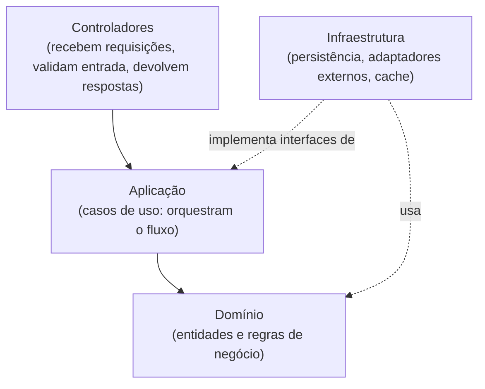
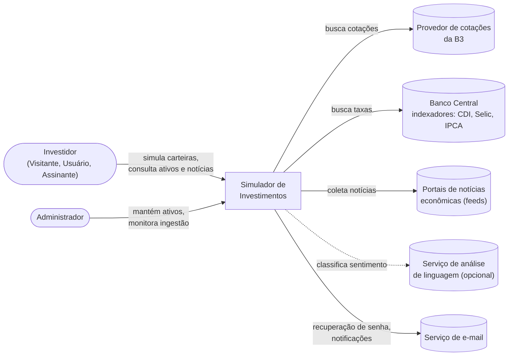
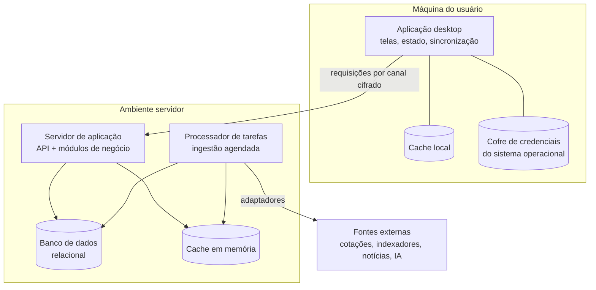
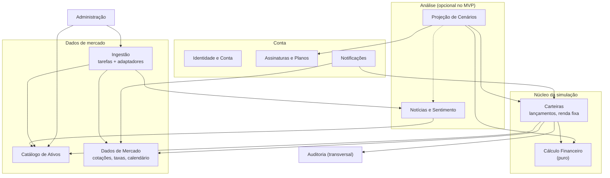
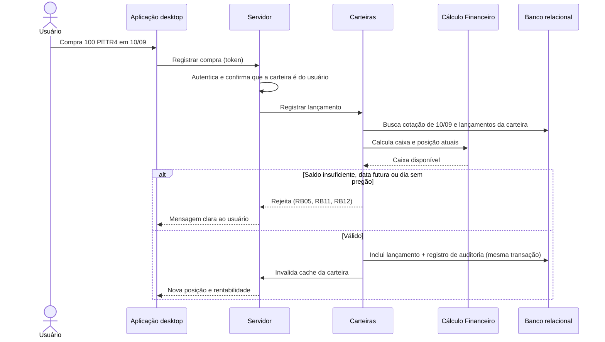
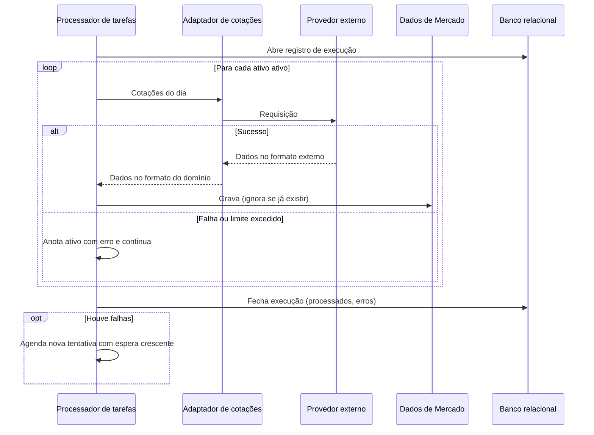
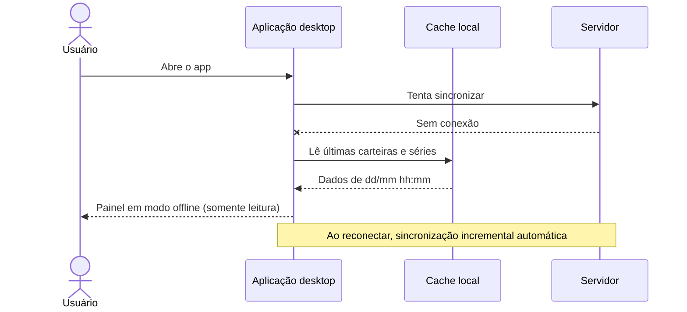
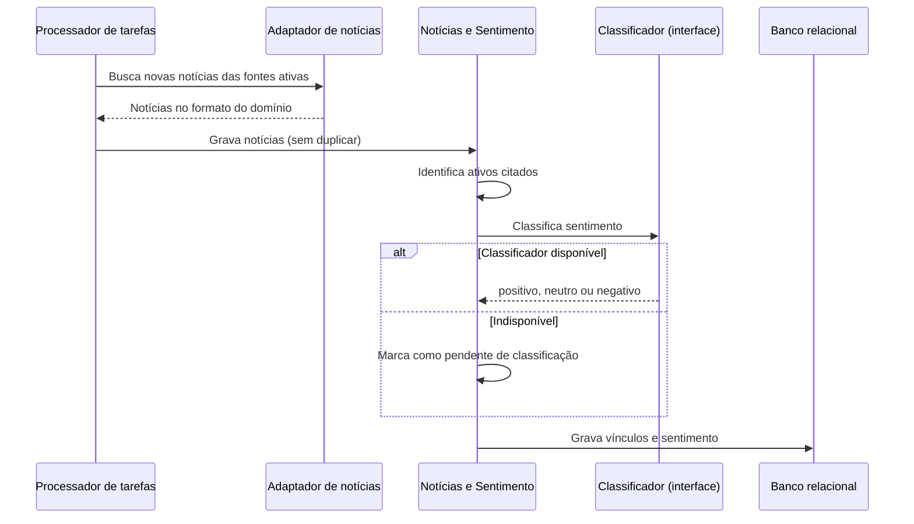
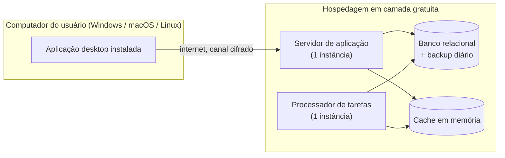

# Documento de Arquitetura

**Projeto:** Simulador de Investimentos
**Universidade Presbiteriana Mackenzie** — Engenharia da Computação
**Integrantes:** Luís Gustavo Sampaio Coêlho, Nicoly Araujo de Paschoa
**Versão:** 1.0

---

## 1. Introdução

### 1.1 Objetivo

Este documento descreve a arquitetura de **alto nível** do Simulador de Investimentos: como o sistema se divide, como as partes se comunicam e quais decisões estruturais foram tomadas, com as alternativas consideradas e o motivo de cada escolha.

O documento é **independente de tecnologia**. Ele fala em "banco de dados relacional", "cache em memória" e "aplicação desktop", não em produtos específicos. As tecnologias escolhidas pela equipe estão no [README](README.md) e são uma das formas possíveis de implementar esta arquitetura.

### 1.2 Documentos relacionados

| Documento | Conteúdo |
|---|---|
| [Drivers Arquiteturais](drivers_arquiteturais.md) | Objetivos, atributos de qualidade, restrições e premissas que orientam as decisões |
| [Visão de produto](Visão%20de%20produto.md) | Visão, problema, público e evolução do produto |
| [Especificação de Requisitos](requisições.md) | Requisitos funcionais, não funcionais e regras de negócio |
| [Personas](personas.md) | Perfis de usuário |
| [Modelo de Domínio](modelo_dominio.md) | Entidades e relacionamentos |
| [Casos de Uso](modelo_casos_de_uso.md) | Diagrama de casos de uso |

### 1.3 Convenções

- **DAxx** — decisão arquitetural (seção 3)
- **OBJ, FAS, QA, RES, PRE, PA** — drivers definidos em [drivers_arquiteturais.md](drivers_arquiteturais.md)
- **RF, RNF, RB** — requisitos e regras de negócio definidos em [requisições.md](requisições.md)

---

## 2. Visão geral

O sistema é uma aplicação **cliente-servidor**:

- Um **cliente desktop** instalado na máquina do usuário, responsável pelas telas, pela experiência de uso e por um cache local para consulta sem conexão.
- Um **servidor central**, que é a **fonte da verdade**: guarda os dados, aplica todas as regras de negócio e é o único que conversa com as fontes externas.
- Um **processador de tarefas em segundo plano**, que coleta cotações, indexadores e notícias de forma agendada, sem depender de o usuário estar usando o app.

O servidor é um **monólito modular**: uma única aplicação implantável, dividida internamente em módulos com fronteiras claras, cada um organizado em **camadas**.

### 2.1 Resumo das principais decisões

| Tema | Decisão | Alternativa descartada |
|---|---|---|
| Estilo geral | Cliente-servidor, servidor como fonte da verdade | App 100% local; app web |
| Organização do servidor | Monólito modular | Microsserviços |
| Organização interna | Camadas + padrão **MVC** | Código sem separação de responsabilidades |
| Cliente | Desktop multiplataforma, uma base de código | Um app nativo por sistema operacional |
| Banco de dados | **Relacional** | NoSQL (documentos) |
| Autenticação | **Própria** (e-mail e senha), com login via Google como evolução | Somente login via Google ou Microsoft |
| Fontes externas | Acessadas por **adaptadores**, só pelo servidor | Cliente consultando as APIs diretamente |
| Ingestão | **Assíncrona e agendada**, em processo separado | Busca sob demanda a cada tela aberta |
| Transações | **Imutáveis**; posição sempre calculada | Tabela de posição editável |
| Cálculo financeiro | Núcleo **puro** e isolado | Regras espalhadas pelas telas e consultas |
| Notícias e IA | Módulo **isolado** e fora do caminho crítico | Classificação dentro da requisição do usuário |
| Offline | Cache local **somente leitura** | Edição offline com resolução de conflitos |

---

## 3. Decisões arquiteturais

Cada decisão segue o formato: **contexto → alternativas → decisão → consequências**.

### DA01 — Cliente-servidor com monólito modular

**Contexto.** O sistema precisa de dados compartilhados entre usuários (cotações, indexadores, notícias), regras que não podem ser burladas (RB05, RB06), plano pago (RF33) e evolução futura (OBJ05). A equipe tem duas pessoas e um semestre (RES01, RES02).

**Alternativas.**
1. **App 100% local**, sem servidor — simples, mas cada usuário consumiria o limite das APIs externas (PA03), não haveria como garantir o plano pago nem compartilhar dados coletados.
2. **Microsserviços** — independência de implantação, mas custo operacional e de infraestrutura incompatível com a equipe e o orçamento.
3. **Monólito modular** — uma única aplicação, dividida em módulos com fronteiras explícitas.

**Decisão.** Alternativa 3. O servidor é a fonte da verdade; o cliente apenas apresenta dados e envia comandos.

**Consequências.**
- (+) Uma única implantação, uma única base de código no servidor, baixo custo.
- (+) Módulos bem delimitados permitem extrair um serviço separado no futuro, se necessário (ex.: IA).
- (−) Exige disciplina: um módulo só acessa outro pela sua interface pública, nunca pelas tabelas dele.

### DA02 — Camadas e padrão MVC

**Contexto.** Regras de negócio precisam ser testáveis sem interface nem banco (QA10) e a troca de fonte de dados não pode afetar as regras (QA08).

**Decisão.** Cada módulo do servidor é organizado em quatro camadas, com dependências sempre apontando para dentro:

Esse arranjo é uma aplicação do padrão **MVC**:

| Papel MVC | No servidor | No cliente |
|---|---|---|
| **Model** | Domínio + infraestrutura (entidades, regras, repositórios) | Estado local e cache |
| **View** | Representação dos dados enviada ao cliente | Telas e componentes visuais |
| **Controller** | Controladores de cada módulo | Lógica de tela que trata ações do usuário e chama o servidor |

**Consequências.**
- (+) O domínio não conhece banco, rede nem interface: pode ser testado isoladamente.
- (+) Trocar banco ou provedor externo altera apenas a camada de infraestrutura.
- (−) Mais arquivos e interfaces do que um código "direto"; aceitável pelo ganho em testabilidade.

### DA03 — Cliente desktop multiplataforma

**Contexto.** A aplicação é desktop e precisa rodar em Windows, macOS e Linux (RES06, QA14), com consulta offline (FAS06) e armazenamento seguro de credenciais (RNF08).

**Alternativas.** App web no navegador; um app nativo por sistema; app desktop multiplataforma com base única.

**Decisão.** App desktop multiplataforma com **uma única base de código**. O cliente tem:
- camada de apresentação (telas);
- controle de estado e de telas;
- cliente de comunicação com o servidor;
- cache local persistente;
- acesso ao **cofre de credenciais do sistema operacional** para guardar tokens.

**Consequências.**
- (+) Uma base de código para três sistemas.
- (+) Acesso a recursos do sistema (cofre de credenciais, biometria — RF04, notificações — RF34/RF35).
- (−) Instalador e atualização da aplicação precisam ser distribuídos (diferente de um site).

### DA04 — Banco de dados relacional

**Contexto.** O [Modelo de Domínio](modelo_dominio.md) é fortemente relacional (usuário → carteira → transação → ativo → cotação). As regras exigem integridade (RB01, RB02), operações atômicas (uma compra debita caixa e cria transação ao mesmo tempo) e valores monetários exatos (RNF12, RB13). Rentabilidade e comparações são consultas de agregação por período.

**Alternativas.**
1. **NoSQL orientado a documentos** — flexível para notícias (texto semiestruturado), mas sem integridade referencial nativa, com transações entre documentos mais limitadas e agregações entre coleções mais trabalhosas.
2. **Relacional** — integridade, transações atômicas, tipo decimal exato, agregações e junções nativas.
3. **Híbrido** (relacional + documentos para notícias) — dois bancos para operar.

**Decisão.** Alternativa 2: um **único banco relacional** para todos os módulos. Notícias ficam em tabelas próprias, com o texto e os metadados variáveis em colunas de texto ou de dados semiestruturados.

**Consequências.**
- (+) Restrições de unicidade, chaves estrangeiras e transações garantem as regras RB01, RB02 e a atomicidade das operações.
- (+) Séries temporais (cotações, taxas diárias) com volume pequeno (PRE02) são bem atendidas por índices únicos em (ativo, data) e (indexador, data).
- (−) Mudanças de esquema exigem migrações versionadas (RNF17).
- (−) Se a análise de notícias crescer muito, pode ser necessário um repositório específico para texto; o módulo isolado (DA11) permite essa troca.

### DA05 — Autenticação própria, com login via provedor externo como evolução

**Contexto.** RF01 pede cadastro com e-mail e senha; RF03 pede recuperação de senha; RF04 pede desbloqueio por biometria. O público inicial é iniciante (P01), para quem "entrar com Google" reduz atrito. A aplicação é desktop, o que torna o fluxo de login com provedor externo mais trabalhoso (precisa abrir o navegador e receber o retorno no app).

**Alternativas.**
1. **Somente login via Google ou Microsoft** — sem senhas para guardar, mas cria dependência de terceiros, exige conta nesses provedores e não atende RF01/RF03 como escritos.
2. **Autenticação própria** com e-mail e senha.
3. **Ambas.**

**Decisão.** Alternativa 2 no MVP, com o módulo de identidade preparado para a alternativa 3:

- Senhas guardadas apenas como hash com algoritmo lento e sal (RNF07).
- Sessão por **token de acesso de curta duração** + **token de renovação** (RF02).
- Tokens guardados no cofre do sistema operacional, nunca em arquivo comum (RNF08).
- Limite de tentativas nas rotas de autenticação (RNF10).
- Biometria (RF04) apenas **desbloqueia** o token já guardado no dispositivo; não substitui o login.
- O módulo de identidade trata "provedor de identidade" como uma interface: adicionar login com Google depois não altera os demais módulos, que só conhecem o identificador do usuário.

**Consequências.**
- (+) Atende os requisitos sem depender de terceiros e sem contas externas obrigatórias.
- (−) A equipe passa a ser responsável por guardar senhas com segurança e pela recuperação de senha, que depende de um serviço de envio de e-mail.

### DA06 — Fontes externas atrás de adaptadores

**Contexto.** Cotações, indexadores e notícias vêm de APIs gratuitas que podem mudar, cobrar ou sair do ar (RES07, PRE03, QA08).

**Decisão.** Cada fonte externa é acessada por um **adaptador** que implementa uma interface definida pelo sistema, por exemplo "provedor de cotações" ("dê-me as cotações do ativo X entre as datas A e B"). O adaptador converte o formato externo para o formato do domínio (camada anticorrupção).

**Consequências.**
- (+) Trocar ou adicionar provedor = escrever um novo adaptador (QA08).
- (+) Permite fontes configuráveis pelo usuário no futuro (Visão §18).
- (+) Permite usar adaptadores falsos nos testes.

### DA07 — Ingestão assíncrona, agendada e centralizada

**Contexto.** Buscar dados externos a cada tela aberta seria lento (QA04), multiplicaria as chamadas às APIs (PA03) e tornaria o app dependente delas (QA02). A coleta de notícias e a classificação de sentimento são lentas e incertas (FAS04).

**Decisão.** Um **processador de tarefas** separado do atendimento de requisições executa, de forma agendada:

| Tarefa | Frequência sugerida |
|---|---|
| Cotações do dia | Após o fechamento do pregão |
| Carga retroativa (backfill) de ativo novo | Sob demanda, quando o ativo é cadastrado |
| Taxas de indexadores | Diária |
| Calendário de pregão | Anual, com revisão manual |
| Coleta de notícias | Algumas vezes ao dia |
| Classificação de sentimento | Logo após cada coleta |

Regras da ingestão:
- **Idempotente**: executar duas vezes não duplica dados (índices únicos em ativo + data).
- **Tentativas com espera crescente** quando a fonte falha.
- **Falha parcial não interrompe o todo**: ativos com erro são registrados e o restante segue.
- Cada execução é registrada (DA14).

**Consequências.**
- (+) Telas leem apenas o banco/cache, portanto são rápidas e independentes das APIs.
- (+) Uma única coleta atende todos os usuários.
- (−) O dado exibido é o da última execução (aceito por PRE01); a tela precisa mostrar a data de atualização.

### DA08 — Cache em dois níveis e offline somente leitura

**Contexto.** O painel deve abrir em menos de 2 s (QA04) mesmo com posição sempre derivada do histórico (PA05), e o app deve funcionar sem conexão (QA03).

**Decisão.**
1. **Cache no servidor** (em memória): cotações recentes e resultados de cálculo por carteira. É invalidado quando entra uma nova transação na carteira ou uma nova cotação de um ativo dela.
2. **Cache local no cliente**: últimas carteiras, posições, séries de preço e notícias consultadas. Sincronização **incremental**: o cliente pede ao servidor apenas o que mudou desde a última sincronização (RNF19).
3. **Offline é somente leitura** no MVP. Sem conexão, as ações de escrita ficam desabilitadas e a interface indica "modo offline — dados de dd/mm hh:mm".

**Alternativa descartada.** Permitir lançamentos offline e sincronizar depois (RF37). Isso exigiria revalidar RB05/RB06 no servidor e tratar lançamentos rejeitados após o fato, aumentando a complexidade. Fica como evolução: uma fila local de comandos pendentes, reenviados e validados pelo servidor ao reconectar.

**Consequências.**
- (+) Atende QA03 e QA04 sem abrir mão do servidor como fonte da verdade.
- (−) Dados locais contêm informação do usuário: precisam ser apagados no logout e na exclusão de conta (QA07).

### DA09 — Lançamentos imutáveis e posição derivada

**Contexto.** RB08 (transação imutável, correção por estorno), RB09 (posição derivada, nunca editada) e QA11 (rastreabilidade).

**Decisão.** A carteira funciona como um **livro-razão**: tudo que altera a carteira é um **lançamento** (compra, venda, aporte, retirada, aplicação e resgate de renda fixa, estorno) que só é **incluído**, nunca alterado ou apagado. Posição, caixa, preço médio e rentabilidade são sempre **calculados** a partir dos lançamentos e das cotações.

**Consequências.**
- (+) É possível reconstruir a carteira em qualquer data passada, base do gráfico de evolução patrimonial (RF17) e do "e se eu tivesse mantido?" (Visão §14).
- (+) A auditoria (RNF15) sai de graça.
- (−) Recalcular tudo a cada consulta tem custo, resolvido pelo cache do DA08. Se necessário, fotografias periódicas da posição podem ser guardadas como **otimização**, nunca como fonte da verdade.

### DA10 — Núcleo de cálculo financeiro puro

**Contexto.** Os cálculos são o coração do produto (QA01) e mudam com regras fiscais (RB14–RB17).

**Decisão.** Todos os cálculos (preço médio, posição, rentabilidade, comparação com benchmark, IR, IOF, dias úteis na base 252) ficam em um **módulo sem acesso a banco, rede ou interface**: recebe dados, devolve resultados. Valores monetários usam **tipo decimal** em todas as camadas; ponto flutuante é proibido para dinheiro (RNF12). Arredondamento: duas casas, meio para cima (RB13), aplicado apenas no resultado final de cada operação.

**Consequências.**
- (+) Testes rápidos e determinísticos com casos de referência (QA10), inclusive comparados à calculadora do Tesouro Direto (Requisitos §7).
- (+) O mesmo núcleo serve para a carteira virtual, para a futura carteira real e para as projeções.

### DA11 — Notícias e IA como módulo isolado

**Contexto.** A análise de notícias é objetivo de pesquisa com resultado incerto (OBJ03, Requisitos §7), prioridade *Could* e a Visão prevê crescimento para IA conversacional e probabilidades (Visão §20, §25). Esse processamento não pode prejudicar o núcleo (PA04).

**Decisão.**
- O módulo **Notícias e Sentimento** só roda no processador de tarefas, nunca dentro de uma requisição do usuário.
- A classificação fica atrás de uma interface "classificador de sentimento"; a implementação (regras simples, modelo local ou serviço externo de IA) pode ser trocada sem afetar o resto.
- Outros módulos só **leem** o resultado (notícia, ativos vinculados, sentimento). Se o módulo estiver fora do ar, a ficha do ativo aparece sem notícias, e nada mais é afetado.
- Toda saída analítica (sentimento, projeção, futura resposta de IA) é tratada como **cenário**, nunca como recomendação (DA15).

**Consequências.**
- (+) O MVP pode ser entregue mesmo que a pesquisa de sentimento não dê resultado.
- (+) A evolução para assistente de IA entra como novo módulo consumidor dos existentes (QA09).

### DA12 — Autorização e planos garantidos no servidor

**Contexto.** RB03 (usuário só acessa as próprias carteiras), RF33 (bloqueio de recursos premium) e perfis distintos (usuário, assinante, administrador).

**Decisão.**
- **Controle de acesso por perfil**: visitante, usuário, assinante e administrador. A área administrativa fica no mesmo cliente, visível apenas ao perfil administrador.
- **Verificação de propriedade** em toda operação sobre carteira: o servidor confere se a carteira pertence ao usuário do token, independentemente do que o cliente enviou.
- **Verificação de plano** no servidor para recursos premium; o cliente apenas esconde os botões, por conveniência.

**Consequências.**
- (+) Um cliente alterado não consegue burlar regras (PA02).

### DA13 — Dados pessoais concentrados

**Contexto.** LGPD (RES05), exportação e exclusão de dados (RF06, RB04).

**Decisão.** Dados pessoais (nome, e-mail, consentimentos) ficam **apenas** no módulo de Identidade e Conta. Os demais módulos referenciam o usuário só por um identificador. A exclusão:
1. remove carteiras e lançamentos do usuário;
2. remove dados pessoais do módulo de identidade;
3. **anonimiza** registros de auditoria e logs que precisam ser mantidos;
4. instrui o cliente a limpar o cache local.

**Consequências.**
- (+) Exportar e excluir dados é uma operação bem delimitada.

### DA14 — Registro de execuções e logs estruturados

**Contexto.** O administrador (P03) precisa ver falhas de ingestão sem acessar o banco (QA12, RF40).

**Decisão.** Cada execução de tarefa grava: tarefa, fonte, início, fim, situação, registros processados, ativos afetados e mensagem de erro. Esses registros ficam no banco e alimentam o painel administrativo, que também permite **reexecutar** uma tarefa. Logs da aplicação são estruturados (campos, não só texto) e nunca contêm senhas ou tokens.

### DA15 — Caráter educacional garantido pela arquitetura

**Contexto.** RB18, RB19 e restrição regulatória da CVM (RES04).

**Decisão.** Toda resposta que contém projeção, cenário ou análise carrega um **indicador de natureza educacional** que o cliente é obrigado a exibir com o aviso padrão. Nenhum módulo produz saídas do tipo "compre" ou "venda".

---

## 4. Visão de contexto

Mostra o sistema como uma caixa e quem interage com ele.

---

## 5. Visão de contêineres

Mostra as partes executáveis e os armazenamentos de dados.

| Contêiner | Responsabilidade |
|---|---|
| Aplicação desktop | Interface, controle de telas, cache local, sincronização incremental, guarda de tokens no cofre do SO |
| Servidor de aplicação | Recebe requisições, autentica, autoriza, executa casos de uso, aplica regras de negócio |
| Processador de tarefas | Executa ingestão e classificação de forma agendada; compartilha o código dos módulos com o servidor, mas roda como processo separado |
| Banco de dados relacional | Fonte da verdade de todos os dados persistentes |
| Cache em memória | Cotações recentes e resultados de cálculo; descartável (pode ser recriado a partir do banco) |

O servidor de aplicação e o processador de tarefas usam **o mesmo código** (mesmo monólito modular), apenas iniciado em dois modos diferentes. Assim, se a ingestão travar, as requisições dos usuários continuam sendo atendidas.

---

## 6. Visão de módulos

### 6.1 Módulos do servidor

| Módulo | Responsabilidade | Requisitos |
|---|---|---|
| Identidade e Conta | Cadastro, login, sessão, recuperação de senha, perfil, consentimento, exportação e exclusão de dados | RF01–RF06 |
| Assinaturas e Planos | Planos, assinatura com pagamento simulado, verificação de acesso a recursos premium | RF32, RF33 |
| Catálogo de Ativos | Ativos, setores, classe, indexador associado, busca | RF07, RF39 |
| Dados de Mercado | Cotações diárias, taxas de indexadores, calendário de pregão; consultas de séries | RF08–RF10 |
| Ingestão | Agendamento, execução e registro das tarefas; adaptadores das fontes externas | RF09, RF10, RF26, RF40 |
| Carteiras | Carteiras, lançamentos (compra, venda, aporte, retirada, renda fixa, estorno), validação das regras de lançamento | RF11–RF13, RF19–RF25 |
| Cálculo Financeiro | Posição, preço médio, rentabilidade, benchmarks, IR, IOF, base 252 | RF14–RF16, RF24 |
| Notícias e Sentimento | Coleta, vínculo notícia–ativo, classificação | RF26–RF29 |
| Projeção de Cenários | Cenários futuros da carteira, com ajuste opcional por sentimento | RF30, RF31 |
| Notificações | Vencimento de renda fixa, variação relevante | RF34, RF35 |
| Administração | Manutenção de ativos, painel de execuções, reexecução de tarefas | RF39, RF40 |
| Auditoria | Registro de operações sobre transações e ações administrativas | RNF15 |

**Regra de dependência:** um módulo usa outro apenas pela sua interface pública. O módulo **Cálculo Financeiro** não depende de nenhum outro. Os módulos de **Análise** dependem do núcleo, mas o núcleo **não** depende deles.

### 6.2 Módulos do cliente

| Módulo | Responsabilidade |
|---|---|
| Telas | Painel, carteiras, ficha do ativo, gráfico Notícias × Preço, renda fixa, projeções, conta, administração |
| Controle de estado | Estado de cada tela, tratamento de ações do usuário |
| Comunicação | Chamadas ao servidor, renovação automática de token, detecção de modo offline |
| Sincronização e cache local | Armazenamento local, sincronização incremental, limpeza no logout |
| Credenciais | Leitura e escrita de tokens no cofre do SO, desbloqueio por biometria |
| Internacionalização | Textos por idioma, formatos de moeda e data |

---

## 7. Visão dinâmica

### 7.1 Registrar compra de ativo

### 7.2 Ingestão diária de cotações com falha parcial

### 7.3 Abrir o painel sem conexão

### 7.4 Coleta e classificação de notícias

---

## 8. Visão de implantação

- Uma instância de cada contêiner é suficiente para o volume previsto (PRE02).
- O banco tem **backup diário** (RNF02); o cache pode ser perdido sem prejuízo.
- Toda comunicação entre cliente e servidor é cifrada (RNF09).
- Disponibilidade alvo de 95% (RNF21): compatível com uma única instância, já que o cliente continua útil em modo offline durante quedas.

---

## 9. Visão de dados

A visão conceitual está no [Modelo de Domínio](modelo_dominio.md). Esta seção indica **qual módulo é dono de cada entidade** e o que falta incluir para suportar as decisões acima.

| Módulo dono | Entidades existentes | Entidades a incluir |
|---|---|---|
| Identidade e Conta | USUARIO | CONSENTIMENTO, TOKEN_RENOVACAO, PERFIL_ACESSO |
| Assinaturas e Planos | — | PLANO, ASSINATURA |
| Catálogo de Ativos | ATIVO, INDEXADOR | SETOR |
| Dados de Mercado | COTACAO, TAXA_DIARIA | CALENDARIO_PREGAO |
| Carteiras | CARTEIRA, TRANSACAO | LANCAMENTO_CAIXA (aporte/retirada), APLICACAO_RENDA_FIXA; tipo **estorno** em TRANSACAO; tipo **real/virtual** em CARTEIRA (evolução) |
| Projeção de Cenários | SIMULACAO | CENARIO (resultado de cada horizonte) |
| Notícias e Sentimento | NOTICIA, NOTICIA_ATIVO | FONTE_NOTICIA (categoria, confiabilidade, ativa/inativa) |
| Ingestão / Administração | — | EXECUCAO_TAREFA, ERRO_EXECUCAO |
| Auditoria | — | REGISTRO_AUDITORIA |

Regras gerais de dados:
- Valores monetários sempre em tipo **decimal** (RNF12).
- **Não existe** tabela de posição: ela é calculada (DA09).
- Séries temporais com **unicidade** em (ativo, data) e (indexador, data).
- Datas de pregão e dias úteis vêm de CALENDARIO_PREGAO (RB11, RB14).
- Mudanças de esquema apenas por **migrações versionadas e reversíveis** (RNF17).

---

## 10. Aspectos transversais

| Aspecto | Abordagem |
|---|---|
| Tratamento de erros | Erros de regra de negócio viram mensagens compreensíveis ao usuário; erros técnicos são registrados e nunca exibidos crus |
| Degradação | Falha de fonte externa → dados da última atualização + data visível; falha de notícias/IA → tela sem essa seção |
| Datas e fuso | Tudo em fuso de Brasília; "dia" sempre significa dia de pregão quando se trata de cotação |
| Dinheiro | Tipo decimal em todas as camadas; arredondamento só no resultado final |
| Segurança | Canal cifrado, senhas com hash, tokens no cofre do SO, limite de tentativas, verificação de propriedade em toda operação |
| Privacidade | Dados pessoais concentrados (DA13); logs sem dados sensíveis |
| Internacionalização | Textos externos ao código; formatação por idioma |
| Acessibilidade | Contraste e navegação por teclado (RNF18) |
| Testes | Núcleo de cálculo com testes automatizados; adaptadores externos substituíveis por versões falsas nos testes |

---

## 11. Pontos de extensão (evolução da Visão de produto)

Como as funcionalidades futuras da [Visão de produto](Visão%20de%20produto.md) se encaixam sem refazer a arquitetura:

| Evolução | Onde entra |
|---|---|
| Carteira real (cadastro manual) | Atributo *tipo* em CARTEIRA; reutiliza lançamentos e o núcleo de cálculo, sem a regra de saldo em caixa |
| Assistente de IA conversacional | Novo módulo consumidor de Carteiras, Dados de Mercado e Notícias, atrás de uma interface de IA (DA11) |
| Probabilidades de alta/queda por horizonte | Evolução do módulo Projeção de Cenários |
| Histórico de acontecimentos semelhantes | Consulta sobre Notícias + Dados de Mercado |
| Fontes personalizadas | Novas instâncias de FONTE_NOTICIA com adaptadores existentes (DA06) |
| Perfil do investidor | Novo módulo que lê o histórico de lançamentos (DA09) |
| Login com Google/Microsoft | Novo provedor no módulo de Identidade (DA05) |
| Lançamentos offline | Fila local de comandos no cliente, validados no servidor ao reconectar (DA08) |
| Integração com corretoras | Novo adaptador que gera lançamentos na carteira real |

---

## 12. Riscos arquiteturais

| Risco | Impacto | Mitigação |
|---|---|---|
| Recalcular posição a partir do histórico ficar lento | Painel acima de 2 s | Cache por carteira (DA08); fotografias periódicas como otimização |
| Provedor externo mudar formato ou encerrar | Dados desatualizados | Adaptadores (DA06); histórico persistido no banco |
| Limites de requisição das APIs | Ingestão incompleta | Coleta centralizada e agendada (DA07); só ativos cadastrados |
| Classificação de sentimento com baixa qualidade | Resultado de pesquisa fraco | Módulo isolado (DA11); resultado negativo é conclusão válida |
| Monólito perder as fronteiras entre módulos | Dificuldade de evolução | Regra de dependência (seção 6.1) e revisão de código |
| Camada gratuita de hospedagem hibernar o servidor | Primeira requisição lenta | Modo offline e cache local absorvem o atraso |
