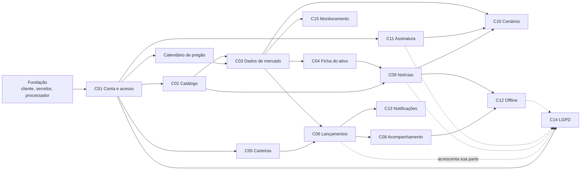

# Mapa de Specs — Spec-Driven Development

**Projeto:** Simulador de Investimentos
**Universidade Presbiteriana Mackenzie** — Engenharia da Computação
**Integrantes:** Luís Gustavo Sampaio Coêlho, Nicoly Araujo de Paschoa
**Status:** ⏳ **Aguardando aprovação humana** — este documento contém apenas a análise da baseline e o índice ordenado das Specs. O conteúdo completo de cada Spec será gerado depois, uma por vez ("Gerar SPEC-XXX").

| Versão | Alteração |
|---|---|
| 1.0 | Primeira versão do mapa |
| 1.1 | OPEN-13 resolvida: custos de operação fora do escopo, com aviso na compra, na venda e na aplicação no Tesouro Direto (RB20, RB21) |
| 1.2 | Escopo inicial em ações e FIIs; renda fixa adiada ([DA22](../adr/DA22-escopo-acoes-fiis-renda-fixa-adiada.md)): SPEC-017, SPEC-018 e SPEC-024 movidas para a fase futura; RB14–RB17 e OPEN-16 a OPEN-20 adiadas; novas OPEN-46 a OPEN-48 |
| 1.3 | Caminho mínimo corrigido: SPEC-019 deixa de depender da SPEC-016; SPEC-034 antecipada para a Fase 1, e cada Spec que cria dado do usuário entrega a sua parte da exportação e da exclusão; RF10 passa a *Should* (Requisitos v1.3), e a SPEC-007 fica no caminho mínimo apenas como dependência técnica |
| 1.4 | Padrão de ingestão passa a ser estabelecido pela SPEC-008; SPEC-008, SPEC-009 e SPEC-027 deixam de depender da SPEC-007; SPEC-011 deixa de depender da SPEC-007; SPEC-007 movida para depois da SPEC-009 e retirada do caminho mínimo |
| 1.5 | Referências desatualizadas corrigidas: OPEN-13 sem o aviso do Tesouro Direto no escopo atual; artefatos lidos incluem DA22; DA07 alterada também por DA22 |
| 1.6 | Classes de ativo Ação e FII ([DA23](../adr/DA23-classes-de-ativo-acoes-e-fiis.md)): OPEN-46 e OPEN-47 resolvidas; SPEC-006, SPEC-020 e SPEC-021 ajustadas; nova RB22 |
| 1.7 | SPEC-001 detalhada ([SPEC-001.md](SPEC-001.md)); OPEN-39 resolvida pela convenção de `down.sql` |

---

## 0. Como ler este documento

- **Seção 1** — análise da baseline: comportamentos, dependências, regras, RNFs, decisões tomadas, inconsistências e decisões em aberto (`OPEN-XX`).
- **Seção 2** — mapa ordenado das Specs (`SPEC-001` a `SPEC-038`).
- **Seção 3** — resumos: cobertura de requisitos, caminho mínimo (Must) e Specs bloqueadas por decisão.

Convenções:

| Marca | Significado |
|---|---|
| `†` | Entidade ou atributo **previsto na [arquitetura](../arquitetura.md) §9**, mas **ainda ausente do [modelo conceitual](../modelo_dominio.md)** (ver OPEN-44) |
| `UC: <nome>` | Caso de uso do [diagrama de casos de uso](../modelo_casos_de_uso.md) |
| `Fluxo 7.x` | Visão dinâmica da [arquitetura](../arquitetura.md) §7 |
| `P01–P03` | [Personas](../personas.md) |
| `(Proposta)` | ADR ainda não aprovado pela equipe |

---

## 1. Análise da baseline

### 1.1 Artefatos lidos

| Artefato | Arquivo |
|---|---|
| Visão de produto | [Visão de produto.md](../Visão%20de%20produto.md) |
| Personas | [personas.md](../personas.md) |
| Requisitos funcionais, não funcionais e regras de negócio | [requisições.md](../requisições.md) |
| Modelo conceitual | [modelo_dominio.md](../modelo_dominio.md) |
| Casos de uso (diagrama) | [modelo_casos_de_uso.md](../modelo_casos_de_uso.md) |
| Drivers arquiteturais | [drivers_arquiteturais.md](../drivers_arquiteturais.md) |
| ADRs DA01–DA23 | [adr/](../adr/README.md) |
| Documento de arquitetura | [arquitetura.md](../arquitetura.md) |
| Decisões técnicas | [decisoes_tecnicas.md](../decisoes_tecnicas.md) |
| README | [README.md](../README.md) |

### 1.2 Principais comportamentos do sistema

| ID | Comportamento | Origem |
|---|---|---|
| C01 | Criar conta, autenticar e manter sessão; perfis de acesso | RF01–RF05, DA05, DA12 |
| C02 | Manter catálogo de ativos e buscar ativos | RF07, RF39, DA16 |
| C03 | Coletar dados de mercado de ações e FIIs (histórico diário, cotações do pregão) e a série do CDI | RF09, RF10, DA07, DA16, DA18, DA22 |
| C04 | Consultar ativo: ficha, cotação com horário, histórico | RF08, DA16 |
| C05 | Gerir carteiras ao vivo e históricas | RF11, DA17 |
| C06 | Registrar lançamentos imutáveis (aporte, retirada, compra, venda, estorno) e derivar caixa, posição e preço médio | RF12–RF14, RB05–RB13, DA09 |
| C07 | ⏸ ~~Aplicar e resgatar renda fixa com IR e IOF~~ **Adiado (DA22)** | RF23–RF25, RB14–RB17 |
| C08 | Acompanhar a carteira: rentabilidade, evolução, benchmarks, distribuição, comparação | RF15–RF20 |
| C09 | Coletar, vincular e classificar notícias; exibir notícias com o preço | RF26–RF29, DA19, DA20, Visão §19 |
| C10 | Gerar cenários por sentimento, com caráter educacional | RF30, RF31, DA15, DA21 |
| C11 | Assinatura com pagamento simulado e recursos por plano | RF32, RF33, DA12, DA16 |
| C12 | Operar sem conexão e sincronizar | RF36, RF37, DA08 |
| C13 | Notificar variações relevantes (vencimentos adiados com a renda fixa) | RF35 |
| C14 | Exportar e excluir dados pessoais (LGPD) | RF06, RB04, DA13 |
| C15 | Administrar e monitorar a ingestão | RF39, RF40, DA14 |
| C16 | Recursos complementares: idioma, biometria, importação, relatório PDF | RF04, RF21, RF22, RF38 |

### 1.3 Dependências entre comportamentos

Pontos de dependência que definem a ordem:

1. **Identidade e perfil** (C01) vêm antes de tudo que é pessoal ou administrativo (DA12).
2. **Calendário de pregão** é usado por ingestão e lançamentos (RB11). Por isso precede C03 e C06.
3. **Caixa** (aportes) precede compras, porque RB05 exige saldo.
4. **Histórico diário** precede a carteira histórica (DA17), a evolução patrimonial (RF17) e os cenários (DA21).
5. **Classificação de notícias** precede cenários por sentimento (DA21).
6. **Plano/assinatura** precede recursos premium: cotações do assinante (DA16) e cenários (RF30).
7. **LGPD** (exportação e exclusão) depende só da identidade (C01) e é entregue cedo. Cada comportamento posterior que guarda dados do usuário (linhas tracejadas) acrescenta a sua parte na exportação e na exclusão.

### 1.4 Regras de negócio e invariantes associados

| RB | Invariante derivado | Specs |
|---|---|---|
| RB01 | Não existem dois usuários com o mesmo e-mail | 002, 004 |
| RB02 | Toda carteira tem exatamente um dono | 012 |
| RB03 | Nenhuma operação acessa carteira de outro usuário | 002, 012 e todas as Specs de carteira |
| RB04 | Pedido de exclusão concluído em até 30 dias | 034 |
| RB05 | Caixa após uma compra nunca fica negativo | 014, 016 |
| RB06 | Posição de um ativo nunca fica negativa | 014, 015, 016 |
| RB07 | Preço do lançamento vem da cotação de referência (**regra em conflito com DA16/DA17**, ver OPEN-09) | 014, 016 |
| RB08 | Lançamentos nunca são alterados nem apagados; correção só por estorno | 013, 014, 015 |
| RB09 | Posição sempre derivada do histórico; não existe posição persistida como fonte da verdade | 013, 014, 019 |
| RB10 | Preço médio muda só em compras | 014 |
| RB11 | Nenhum lançamento em dia sem pregão | 005, 013, 014, 016 |
| RB12 | Nenhum lançamento com data futura | 013, 016 |
| RB13 | Valores monetários com 2 casas, arredondamento meio para cima | 013–023 |
| RB14 | ⏸ Adiada (DA22) — renda fixa calculada em base 252 dias úteis | Fase futura |
| RB15 | ⏸ Adiada (DA22) — IOF regressivo em resgates com menos de 30 dias | Fase futura |
| RB16 | ⏸ Adiada (DA22) — IR pela tabela regressiva no resgate (ver OPEN-17) | Fase futura |
| RB17 | ⏸ Adiada (DA22) — sem resgate antecipado durante a carência | Fase futura |
| RB18 | Nenhuma saída do tipo "compre"/"venda" | 031 |
| RB19 | Toda tela de cenário exibe aviso educacional | 031 |
| RB20 | Preço médio, caixa e rentabilidade não incluem custos de operação | 014, 016, 019 |
| RB21 | Toda tela de compra e venda de ações e FIIs exibe o aviso de custos não considerados | 014, 016 |
| RB22 | Todo ativo tem exatamente uma classe (Ação ou FII), definida no cadastro e nunca alterada nem deduzida do ticker | 006, 021 |

Invariantes vindos das ADRs (não estão em `requisições.md`, ver OPEN-09 e OPEN-32):

| Origem | Invariante | Specs |
|---|---|---|
| DA17 | Tipo da carteira é imutável após a criação | 012 |
| DA17 | Lançamentos da carteira histórica em ordem cronológica não decrescente | 016 |
| DA16 | A interface nunca exibe "tempo real"; toda cotação mostra o horário | 009, 010, 026 |
| DA16, DA12 | Usuário só recebe cotações compatíveis com o plano | 026 |
| DA19 | A fonte pai não pode ser desativada nem trocada pelo usuário | 027, 030 |
| DA19, DA20 | Fontes do usuário nunca entram no treino nem nas probabilidades oficiais | 028, 030, 031 |
| DA20 | Toda classificação registra a versão do modelo | 028 |
| DA21 | Cenário com n abaixo do mínimo exibe "dados insuficientes" | 031 |

### 1.5 Requisitos não funcionais e onde se aplicam

RNFs transversais **não** viram Specs próprias; cada um é associado às Specs em que é verificado.

| RNF | Tema | Specs |
|---|---|---|
| RNF01 | Tecnologias do cliente e da API (definidas) | 001 |
| RNF02 | Banco relacional com backup diário | 001 |
| RNF03 | Cache de cotações no servidor | 009, 019 |
| RNF04 | Interface adaptável ao tamanho da janela | Transversal — todas as Specs com tela |
| RNF05 | Windows, macOS e Linux | 001 |
| RNF06 | Painel em menos de 2 s com até 50 ativos | 019 |
| RNF07 | Senhas com hash | 002, 004 |
| RNF08 | Tokens no armazenamento seguro do SO | 002, 036 |
| RNF09 | Somente HTTPS | 001, 030 |
| RNF10 | Limite de tentativas nas rotas de autenticação | 002, 004 |
| RNF11 | LGPD: consentimento e exclusão | 002, 003, 034 |
| RNF12 | Dinheiro em tipo decimal | Transversal — 013 a 023 |
| RNF13 | Falha de fonte externa não interrompe o app | 007, 008, 009, 010, 027, 028, 029, 032 |
| RNF14 | Modo leitura sem conexão | 032 |
| RNF15 | Auditoria das transações | 006 (ações administrativas), 013, 014, 015 |
| RNF16 | Testes automatizados no cálculo financeiro | 005, 014, 019, 020 |
| RNF17 | Migrações versionadas e reversíveis | 001 e toda Spec que altere o esquema |
| RNF18 | Acessibilidade WCAG AA básico | Transversal — todas as Specs com tela |
| RNF19 | Sincronização incremental | 032 |
| RNF20 | Múltiplos idiomas | 001 (textos fora do código desde o início), 035, todas as Specs com tela |
| RNF21 | Disponibilidade de 95% | 001, 032 |

### 1.6 Restrições e decisões arquiteturais já tomadas

| Tema | Decisão | ADR | Status |
|---|---|---|---|
| Estilo | Cliente-servidor; servidor como fonte da verdade; monólito modular | DA01 | Aceita |
| Organização | Camadas + MVC | DA02 | Aceita |
| Cliente | Desktop multiplataforma | DA03 | Aceita |
| Banco | Relacional único | DA04 | Aceita |
| Autenticação | Própria (e-mail e senha); Google como evolução | DA05 | Aceita |
| Fontes externas | Adaptadores, só pelo servidor | DA06 | Aceita |
| Ingestão | Assíncrona, agendada, centralizada | DA07 | Aceita (alterada por DA16, DA18, DA22) |
| Cache/offline | Dois níveis; offline somente leitura | DA08 | Aceita |
| Lançamentos | Imutáveis; posição derivada | DA09 | Aceita |
| Cálculo | Núcleo puro | DA10 | Aceita |
| Notícias/IA | Módulo isolado | DA11 | Aceita |
| Autorização | Perfil, propriedade e plano no servidor | DA12 | Aceita |
| Privacidade | Dados pessoais concentrados | DA13 | Aceita |
| Observabilidade | Registro de execuções + logs estruturados | DA14 | Aceita |
| Conformidade | Indicador educacional obrigatório | DA15 | Aceita |
| Cotações | Pregão com atraso por plano | DA16 | Aceita, com pontos em aberto |
| Carteiras | Ao vivo e histórica | DA17 | Aceita, com pontos em aberto |
| Histórico | Arquivos da B3 | DA18 | **Proposta** |
| Fontes de notícias | Pai + curadas + do usuário | DA19 | Aceita, com ponto crítico |
| Modelo de IA | Versionado, treinado fora do servidor | DA20 | Aceita, com pontos em aberto |
| Cenários | Probabilidade condicional ao sentimento | DA21 | **Proposta** |
| Escopo | Ações e FIIs; renda fixa adiada | DA22 | Aceita, com pontos em aberto |
| Classes de ativo | Ação (inclui units) e FII; setor e segmento; ETFs e BDRs fora | DA23 | Aceita |

Restrições: prazo de um semestre, dois integrantes, custo zero, CVM, LGPD, desktop multiplataforma, APIs gratuitas com limite, sem ordens nem pagamento reais (RES01–RES09).

### 1.7 Inconsistências, lacunas e ambiguidades encontradas

Nenhuma delas foi resolvida neste mapa. Cada uma aponta para uma decisão em aberto (seção 1.8).

| ID | Inconsistência / lacuna | Documentos | OPEN |
|---|---|---|---|
| INC-01 | O diagrama de casos de uso tem o ator **"Gateway de pagamento"**, mas os requisitos dizem que o pagamento é **simulado** e que pagamento real está fora do escopo | Casos de uso × Requisitos §1.1 | OPEN-25 |
| INC-02 | O diagrama não tem os atores **Administrador** e **Sistema**, nem casos de uso de aporte/retirada, LGPD, administração, offline, notificações, fontes de notícias e carteira histórica | Casos de uso × Requisitos × ADRs | OPEN-43 |
| INC-03 | **RB07** ("cotação da data do lançamento") não foi reescrita após DA16/DA17, que definem preço diferente para carteira ao vivo e histórica | Requisitos × DA16, DA17 | OPEN-09 |
| INC-04 | **RF37** (sincronizar dados pendentes) pressupõe escrita offline; **RNF14** e **DA08** definem offline somente leitura | Requisitos × DA08 | OPEN-10 |
| INC-05 | O **modelo conceitual** não tem entidades citadas pelas regras e pela arquitetura (calendário, lançamento de caixa, estorno, plano, assinatura, fonte de notícia, execução de tarefa, auditoria, tipo de carteira etc.) | Modelo × Requisitos §5 × Arquitetura §9 | OPEN-44 |
| INC-06 | Cenários: DA21 e o fluxo 7.5 calculam cenários **por ativo**; RF30 e o caso de uso "Gerar simulação da carteira" falam em cenários **da carteira**. RF31 não foi reescrito | DA21 × RF30, RF31 × Casos de uso | OPEN-34 |
| INC-07 | "Simulação" tem três sentidos: SIMULACAO no modelo (projeção), "salvar simulações" em RF20 e "criar uma nova simulação" nas personas (equivalente a uma carteira) | Modelo × RF20 × P02 | OPEN-22 |
| INC-08 | A **Visão** põe a carteira real no MVP; os **requisitos** não têm nenhum RF de carteira real | Visão §9, §24 × Requisitos | OPEN-42 |
| INC-09 | O diagrama liga "Buscar ativo" e "Consultar cotação" diretamente à API de mercado; DA07 diz que as telas só leem banco e cache. DA16 limita o catálogo a ~40–50 ativos | Casos de uso × DA07, DA16 | OPEN-41 |
| INC-10 | Fontes do usuário (DA19) e cotações por plano (DA16) não têm RFs em `requisições.md` | ADRs × Requisitos | OPEN-09, OPEN-32 |
| INC-11 | RNF17 exige migrações reversíveis; o ORM definido não gera reversão automaticamente | Requisitos × Decisões técnicas | OPEN-39 ✅ |
| INC-12 | RF04 (biometria) é multiplataforma nos requisitos, mas só é simples no macOS | Requisitos × Decisões técnicas | OPEN-36 |
| INC-13 | ⏸ *(adiada com a renda fixa — DA22)* RB16 aplica IR a todo resgate, sem tratar produtos que podem ter tratamento fiscal diferente (LCI/LCA) | Requisitos | OPEN-17 |
| INC-14 | CARTEIRA tem `saldo_inicial`; RF13 tem aportes. Não está definido como um se relaciona com o outro, nem se uma retirada pode deixar o caixa negativo (RB05 só trata compra) | Modelo × RF13 | OPEN-11 |
| INC-15 | O cenário da P01 distribui o valor **por percentual** ("50% em PETR4"); RF12 registra compra **por quantidade** | Personas × RF12 | OPEN-24 |
| INC-16 | ⏸ *(adiada com a renda fixa — DA22)* O caso de uso "Projetar renda fixa" não tem RF correspondente | Casos de uso × Requisitos | OPEN-19 |
| INC-17 | RF11 permite **excluir** carteira; RB08 e RNF15 exigem imutabilidade e auditoria dos lançamentos | Requisitos | OPEN-15 |
| INC-18 | RB13 trata dinheiro, mas o modelo usa `quantidade` decimal sem dizer se ações aceitam frações | Modelo × Requisitos | OPEN-12 |
| INC-19 | ~~Custos de operação (corretagem, emolumentos, custódia) não aparecem em nenhum documento, mas afetam preço médio e rentabilidade~~ **Resolvida** em `requisições.md` v1.1 (RB20, RB21) | Lacuna | OPEN-13 |

### 1.8 Decisões em aberto

Os itens `PExx` são os pontos em aberto já listados na [arquitetura §13](../arquitetura.md); aqui recebem um identificador `OPEN-XX` para rastreio nas Specs.

| ID | Decisão necessária | Origem | Specs afetadas |
|---|---|---|---|
| OPEN-01 | Fonte e responsável pela manutenção do calendário de pregão (hoje "Sugerida") | Decisões técnicas §3 | 005 |
| OPEN-02 | Hospedagem (servidor, processador, banco com backup diário, cache) e serviço de e-mail | PE13 | 001, 004 |
| OPEN-03 | Como uma conta de administrador é criada ou promovida | Lacuna | 002, 006, 011 |
| OPEN-04 | Formato, conteúdo e forma de entrega da exportação de dados pessoais | RF06 | 034 |
| OPEN-05 | Aprovação de DA18 (histórico pelos arquivos da B3, hoje **Proposta**) e tamanho da janela histórica carregada | DA18, PE04 | 008, 016 |
| OPEN-06 | **[Prioritário]** Fonte e tratamento de proventos e eventos corporativos, incluindo os **rendimentos mensais dos FIIs** (vale para carteira histórica e ao vivo) | PE05, DA22 | 008, 014, 016, 019 |
| OPEN-07 | Termos da brapi para redistribuir cotações | PE02 | 009, 026 |
| OPEN-08 | Compra/venda na carteira ao vivo com a bolsa fechada e sua relação com RB11 | PE03 | 013, 014 |
| OPEN-09 | Reescrever RB07 e incluir em `requisições.md` as regras de DA16/DA17 (preço por plano, tipo imutável, ordem cronológica) e ajustar RF09, RF11, RF33 | DA16, DA17 | 012, 014, 016, 026 |
| OPEN-10 | RF37 (escrita offline) × RNF14/DA08 (somente leitura): ajustar ou remover RF37 | INC-04 | 032 |
| OPEN-11 | Relação entre `saldo_inicial` e aportes; retirada maior que o caixa | INC-14 | 012, 013 |
| OPEN-12 | Quantidade fracionária de ações e regras de lote | INC-18 | 014, 016 |
| OPEN-13 | ✅ **Resolvida pela equipe:** custos de operação ficam fora do escopo, com aviso ao usuário na compra e na venda de ações e FIIs (RB20, RB21); o aviso na aplicação no Tesouro Direto volta com a renda fixa (DA22) | INC-19 | 014, 016, 019; 024 na fase de renda fixa |
| OPEN-14 | Regras do estorno: o que pode ser estornado, efeito em lançamentos posteriores, estorno de estorno, estorno na carteira histórica | RB08 | 015, 016 |
| OPEN-15 | Exclusão de carteira: exclusão definitiva ou arquivamento, preservando auditoria | INC-17 | 012, 034 |
| OPEN-16 | ⏸ **Adiada com a renda fixa (DA22).** Tipos de remuneração da renda fixa (prefixado, % do CDI, IPCA + taxa) e atributos da aplicação (taxa contratada, carência) | Modelo, arquitetura §9 | 017 |
| OPEN-17 | ⏸ **Adiada com a renda fixa (DA22).** Tratamento fiscal por produto (ex.: LCI/LCA) | INC-13 | 018, 024 |
| OPEN-18 | ⏸ **Adiada com a renda fixa (DA22).** Valorização e resgate do Tesouro Direto (preço publicado × curva); confirmar a fonte (hoje "Sugerida") | Decisões técnicas §3 | 024 |
| OPEN-19 | ⏸ **Adiada com a renda fixa (DA22).** Significado do caso de uso "Projetar renda fixa" | INC-16 | 017 |
| OPEN-20 | ⏸ **Adiada com a renda fixa (DA22).** Renda fixa na carteira histórica | DA17 PO4 | 016, 017 |
| OPEN-21 | Fonte do histórico do Ibovespa | PE06 | 020 |
| OPEN-22 | Significado de "simulação" (RF20 × SIMULACAO × personas) e de "Comparar cenários" × RF19 | INC-07 | 022, 023 |
| OPEN-23 | Comparação pode misturar carteira ao vivo e histórica? | DA17 PO3 | 022 |
| OPEN-24 | Montagem da carteira por percentual (cenário P01) × registro por quantidade | INC-15 | 014, 016 |
| OPEN-25 | Fluxo da assinatura com pagamento simulado (duração, renovação, cancelamento, expiração) e ator "Gateway de pagamento" | INC-01 | 025 |
| OPEN-26 | Lista de recursos premium além de cenários e cotações com menor atraso | RF33 | 025 |
| OPEN-27 | Quem paga o provedor de cotações do assinante | PE01 | 026 |
| OPEN-28 | **[Crítico]** Autorização de uso do Investidor10 como fonte pai, ou troca por fonte aberta | PE07 | 027 |
| OPEN-29 | Lista de fontes curadas e critério de confiabilidade | Decisões técnicas §3 | 027 |
| OPEN-30 | Implementação do modelo de IA, onde roda, métrica mínima e frequência de retreino | PE10, DA20 | 028 |
| OPEN-31 | Fonte do histórico de notícias e janela de treino | PE09, PE11 | 028, 031 |
| OPEN-32 | RFs para fontes do usuário; limite de fontes; conversão da prioridade em peso | DA19, PE08 | 030 |
| OPEN-33 | Aprovação de DA21 (**Proposta**); horizontes, limite de estabilidade, n mínimo; cenário com sentimento personalizado | DA21, PE12 | 031 |
| OPEN-34 | Cenário por ativo ou por carteira; reescrita de RF30/RF31 | INC-06 | 031 |
| OPEN-35 | Limiar de "variação relevante", antecedência do aviso de vencimento, notificação com o app fechado | RF34, RF35 | 033 |
| OPEN-36 | Escopo de RF04 por sistema operacional | INC-12 | 036 |
| OPEN-37 | Formato e conteúdo do arquivo de importação (RF21) | Lacuna | 037 |
| OPEN-38 | Conteúdo do relatório PDF (RF22) | Lacuna | 038 |
| OPEN-39 | ✅ **Resolvida na [SPEC-001](SPEC-001.md):** cada migração tem um `down.sql` escrito à mão e o comando `db:rollback` desfaz a última | INC-11 | 001 |
| OPEN-40 | Retenção de backups (× RB04), de registros de execução e de cotações intradiárias | DA13, DA14, DA04 | 001, 007, 008, 009, 011, 034 |
| OPEN-41 | Busca de ativos: só no catálogo curado ou em qualquer ticker da B3 | INC-09 | 006 |
| OPEN-42 | Carteira real: confirmar fora do MVP | INC-08 | — (nenhuma Spec criada) |
| OPEN-43 | Atualizar o diagrama de casos de uso | INC-02 | Várias |
| OPEN-44 | Aprovar no modelo conceitual as entidades previstas na arquitetura §9 | INC-05 | Várias (marcadas com `†`) |
| OPEN-45 | Com interface em inglês, notícias (em português, PRE04) e textos gerados continuam em português? | RF38 × PRE04 | 035 |
| OPEN-46 | ✅ **Resolvida (DA23):** FIIs comparados com CDI e Ibovespa no escopo atual; IFIX como evolução | DA22, DA23 | 020 |
| OPEN-47 | ✅ **Resolvida (DA23):** ações classificadas por setor e FIIs por segmento | DA22, DA23 | 006, 021 |
| OPEN-48 | Confirmar que as fontes de cotação (atual e histórica) cobrem os FIIs do catálogo | DA22 | 008, 009 |

---

## 2. Mapa ordenado de Specs

Visão geral por fase:

| Fase | Specs | Entrega |
|---|---|---|
| 0 — Fundação | 001 | Estrutura executável |
| 1 — Conta e acesso | 002–004, 034 | Usuário identificado e seguro; exportação e exclusão de dados desde o início |
| 2 — Dados de mercado | 005–011 | Calendário, catálogo, indexadores, cotações, ficha do ativo, monitoramento |
| 3 — Núcleo da carteira | 012–016 | Carteiras e lançamentos (ao vivo e histórica) |
| 4 — Renda fixa | ⏸ Adiada (DA22) | Ver "Fase futura — Renda fixa" ao fim desta seção |
| 5 — Acompanhamento | 019–023 | Rentabilidade, benchmarks, distribuição, comparação, simulações |
| 6 — Assinatura | 025–026 | Planos e cotações do assinante |
| 7 — Notícias e cenários | 027–031 | Fontes, classificação, gráfico, preferências, cenários |
| 8 — Experiência e conformidade | 032, 033, 035–038 | Offline, notificações, idioma, biometria, importação, PDF |
| Futura — Renda fixa | 017, 018, 024 | ⏸ Adiada (DA22) |

---

### Fase 0 — Fundação

#### SPEC-001 — Esqueleto executável cliente–servidor–processador

📄 Detalhada em [SPEC-001.md](SPEC-001.md) — em implementação.

| Campo | Conteúdo |
|---|---|
| Objetivo | Estabelecer a estrutura executável definida pela arquitetura: aplicação desktop que se comunica com o servidor por canal cifrado; servidor como monólito modular em camadas; processador de tarefas iniciado como segundo modo do mesmo código; banco relacional com migrações versionadas; logs estruturados |
| Valor | **Sistema:** base comum para todas as Specs; valida cedo a portabilidade (3 SOs) e o canal cifrado |
| RF | Nenhum diretamente (habilita todos) |
| RB | — |
| RNF | RNF01, RNF02, RNF04, RNF05, RNF09, RNF17, RNF20 (textos fora do código desde o início), RNF21 |
| Caso de uso / fluxo | — (Spec técnica) |
| Entidades | Nenhuma de negócio |
| Drivers | OBJ04, RES01–RES03, RES06, RES09, QA14, PA01 |
| ADRs | DA01, DA02, DA03, DA04, DA07 (processador separado), DA14 (logs estruturados) |
| Depende de | — |
| Posição | Spec técnica cuja necessidade está demonstrada em DA01–DA03 e DA07: toda capacidade pressupõe cliente, servidor, processador e banco. Primeira por não ter dependências |
| Em aberto | OPEN-02, OPEN-40 (OPEN-39 resolvida) |
| Prioridade derivada | Técnica (habilita os Must) |

---

### Fase 1 — Conta e acesso

#### SPEC-002 — Cadastro, autenticação e sessão

| Campo | Conteúdo |
|---|---|
| Objetivo | O visitante cria conta com e-mail e senha, registrando o consentimento; autentica-se e mantém sessão com renovação automática; o servidor passa a identificar o usuário e o seu perfil de acesso em toda requisição |
| Valor | **Usuário:** acesso pessoal e seguro. **Sistema:** identidade e perfil, pré-requisitos de RB03 e DA12 |
| RF | RF01, RF02 |
| RB | RB01, RB03 (base) |
| RNF | RNF07, RNF08, RNF09, RNF10, RNF11 (consentimento) |
| Caso de uso / fluxo | UC: Cadastrar conta (inclui Gerenciar perfil e consentimento); UC: Autenticar-se |
| Entidades | USUARIO; CONSENTIMENTO†, TOKEN_RENOVACAO†, PERFIL_ACESSO† |
| Drivers | FAS07, QA05, QA06, RES05 |
| ADRs | DA05, DA12, DA13 |
| Depende de | SPEC-001 |
| Posição | Tudo que é pessoal (carteiras, preferências, assinatura) ou administrativo (calendário, catálogo) exige identidade e perfil |
| Em aberto | OPEN-03 |
| Prioridade derivada | Must |

#### SPEC-003 — Perfil do usuário e consentimento

| Campo | Conteúdo |
|---|---|
| Objetivo | O usuário consulta e edita seus dados de perfil e consulta/altera seus consentimentos |
| Valor | **Usuário:** controle sobre os próprios dados. **Sistema:** atende parte da LGPD |
| RF | RF05 |
| RB | RB01 (e-mail continua único ao editar) |
| RNF | RNF11 |
| Caso de uso / fluxo | UC: Gerenciar perfil e consentimento |
| Entidades | USUARIO, CONSENTIMENTO† |
| Drivers | QA07, RES05 |
| ADRs | DA13 |
| Depende de | SPEC-002 |
| Posição | Completa o caso de uso de conta e só depende da identidade |
| Em aberto | — |
| Prioridade derivada | Should |

#### SPEC-004 — Recuperação de senha por e-mail

| Campo | Conteúdo |
|---|---|
| Objetivo | O usuário que esqueceu a senha recebe por e-mail um meio de redefini-la |
| Valor | **Usuário:** não perde a conta. **Sistema:** reduz suporte manual |
| RF | RF03 |
| RB | RB01 |
| RNF | RNF07, RNF10 |
| Caso de uso / fluxo | Fluxo alternativo de UC: Autenticar-se (não representado no diagrama, ver OPEN-43) |
| Entidades | USUARIO |
| Drivers | FAS07, QA06 |
| ADRs | DA05 (dependência de serviço de e-mail) |
| Depende de | SPEC-002 |
| Posição | Separada da 002 porque depende de integração externa ainda não escolhida (OPEN-02) e tem validação própria; não bloqueia nenhuma Spec seguinte |
| Em aberto | OPEN-02 |
| Prioridade derivada | Should |

#### SPEC-034 — Exportação e exclusão de dados pessoais

| Campo | Conteúdo |
|---|---|
| Objetivo | O usuário exporta todos os seus dados e pede a exclusão da conta: dados pessoais removidos, auditoria e logs anonimizados e cache local limpo, em até 30 dias. Nesta Spec, cobre os dados criados até aqui (conta e consentimento); **cada Spec posterior que guarde dados do usuário entrega a sua parte** na exportação e na exclusão (ver "Posição") |
| Valor | **Usuário:** direitos da LGPD. **Sistema:** conformidade (RES05) desde o início |
| RF | RF06 |
| RB | RB04 |
| RNF | RNF11 |
| Caso de uso / fluxo | UC: Gerenciar perfil e consentimento |
| Entidades | USUARIO, CONSENTIMENTO†, TOKEN_RENOVACAO†, REGISTRO_AUDITORIA† (anonimização). Entram depois, cada uma com a sua Spec: CARTEIRA, TRANSACAO, LANCAMENTO_CAIXA† (012–016), SIMULACAO (023), ASSINATURA† (025), PREFERENCIA_FONTE† e FONTE_NOTICIA† do usuário (030), cache local (032) |
| Drivers | FAS09, QA07, PA06, RES05 |
| ADRs | DA08, DA13, DA19 |
| Depende de | SPEC-002 |
| Posição | **Antecipada** (versão 1.3 do mapa): fica logo depois da identidade, e o mecanismo de exportação e exclusão passa a existir antes de qualquer outro dado pessoal. Regra para as Specs seguintes: **toda Spec que crie dado do usuário inclui, nos seus critérios de aceitação, a exportação e a exclusão desse dado** — hoje 012, 013, 014, 015, 016, 023, 025, 030 e 032. Assim a 034 não precisa esperar Specs que não são *Must* |
| Em aberto | OPEN-04, OPEN-15, OPEN-40 |
| Prioridade derivada | Must |

---

### Fase 2 — Dados de mercado

#### SPEC-005 — Calendário de pregão

| Campo | Conteúdo |
|---|---|
| Objetivo | O sistema responde se uma data é dia de pregão da B3 e conta pregões entre duas datas; o administrador carrega e revisa o calendário anualmente |
| Valor | **Sistema:** base única para ingestão e lançamentos (RB11); na fase de renda fixa, também para a base 252 |
| RF | Nenhum diretamente (suporta RF09, RF12, RF13) |
| RB | RB11 |
| RNF | RNF16 (contagem de pregões no núcleo de cálculo) |
| Caso de uso / fluxo | — (Requisitos §5: rastreabilidade de RB11) |
| Entidades | CALENDARIO_PREGAO† |
| Drivers | PRE05, QA01 |
| ADRs | DA07 (tarefa anual com revisão manual), DA10 |
| Depende de | SPEC-002 (perfil administrador) |
| Posição | Usada por 007, 008, 009, pelas Specs de lançamento e pelos cenários (031) |
| Em aberto | OPEN-01 |
| Prioridade derivada | Técnica de regra (habilita os Must) |

#### SPEC-006 — Catálogo de ativos: manutenção e busca

| Campo | Conteúdo |
|---|---|
| Objetivo | O administrador cadastra, edita e ativa/desativa ativos informando ticker, nome, **classe** (Ação ou FII, imutável) e **setor** (ações) ou **segmento** (FIIs); o usuário busca ativos por ticker, nome, classe, setor ou segmento |
| Valor | **Usuário:** encontra ativos para estudar e simular. **Sistema:** conjunto curado que define o que é coletado (DA16) |
| RF | RF07, RF39 |
| RB | RB22 |
| RNF | RNF15 (auditoria de ações administrativas), RNF04, RNF18 |
| Caso de uso / fluxo | UC: Buscar ativo; P01 passo 1; P03 "cadastrar ou atualizar ativos" |
| Entidades | ATIVO (classe: Ação ou FII), SETOR† (setores das ações e segmentos dos FIIs) |
| Drivers | OBJ02, FAS10, PA03 |
| ADRs | DA12, DA16 (catálogo curado de ~40–50 ativos, divididos entre ações e FIIs), DA22, DA23 |
| Depende de | SPEC-002 |
| Posição | O ativo é referenciado por cotações, lançamentos e notícias; precisa existir antes da ingestão |
| Em aberto | OPEN-03, OPEN-41 |
| Prioridade derivada | Must (RF07); Should (RF39) |

#### SPEC-008 — Carga do histórico diário de cotações

| Campo | Conteúdo |
|---|---|
| Objetivo | Carregar o histórico de fechamento diário dos ativos do catálogo (ações e FIIs), inclusive a carga retroativa quando um ativo é cadastrado, com regra de precedência entre fontes. **Estabelece o padrão de ingestão** (adaptador, idempotência, novas tentativas e execução registrada) reutilizado pelas demais ingestões (007, 009, 027) |
| Valor | **Sistema:** base para carteira histórica, gráficos, evolução patrimonial e cenários; primeiro uso do padrão de ingestão |
| RF | RF09 (parte histórica) |
| RB | RB11 |
| RNF | RNF12, RNF13 |
| Caso de uso / fluxo | UC: Consultar cotação (lado do sistema) |
| Entidades | COTACAO, ATIVO, EXECUCAO_TAREFA†, ERRO_EXECUCAO† |
| Drivers | FAS03, QA02, QA08, QA12, PA03, RES03, RES07, PRE03 |
| ADRs | DA06, DA07, DA14, DA18 (Proposta) |
| Depende de | SPEC-001, SPEC-005, SPEC-006 |
| Posição | Primeira ingestão: define o padrão usado pelas outras. Precede tudo que olha para o passado (010, 016, 019, 031) |
| Em aberto | **OPEN-05 (bloqueante: DA18 não aprovado)**, OPEN-06, OPEN-40, OPEN-48 |
| Prioridade derivada | Must |

#### SPEC-009 — Cotações do pregão (nível gratuito) e fechamento diário

| Campo | Conteúdo |
|---|---|
| Objetivo | Coletar cotações de ações e FIIs a cada ~30 min apenas em horário de pregão e para ativos do catálogo, e o fechamento após o pregão; cada cotação guarda data, hora, fonte e nível; em caso de falha, mantém o último dado válido |
| Valor | **Usuário:** preço do dia com horário de referência. **Sistema:** preço para a carteira ao vivo |
| RF | RF09 |
| RB | RB11 |
| RNF | RNF03, RNF12, RNF13 |
| Caso de uso / fluxo | UC: Consultar cotação; fluxo 7.2 |
| Entidades | COTACAO (data e hora, fonte, nível†), ATIVO |
| Drivers | FAS03, QA02, QA04, PA03, RES07 |
| ADRs | DA06, DA07, DA08, DA14, DA16 |
| Depende de | SPEC-005, SPEC-006, SPEC-008 (padrão de ingestão) |
| Posição | Pré-condição da compra e venda ao vivo (014) |
| Em aberto | OPEN-07, OPEN-40, OPEN-48 |
| Prioridade derivada | Must |

#### SPEC-007 — Ingestão da série do CDI

| Campo | Conteúdo |
|---|---|
| Objetivo | O processador coleta a série diária do CDI da fonte do Banco Central, de forma idempotente, com novas tentativas e registro de cada execução, reutilizando o padrão de ingestão criado na SPEC-008 (Selic e IPCA entram na fase de renda fixa) |
| Valor | **Sistema:** série do benchmark CDI |
| RF | RF10 |
| RB | — |
| RNF | RNF13 |
| Caso de uso / fluxo | UC: Consultar taxa do indexador (lado do sistema); fluxo 7.2 (mesmo padrão) |
| Entidades | INDEXADOR (CDI), TAXA_DIARIA, EXECUCAO_TAREFA† |
| Drivers | FAS03, QA02, QA08, QA12 |
| ADRs | DA06, DA07, DA14, DA22 |
| Depende de | SPEC-005, SPEC-008 |
| Posição | Depois das cotações (008, 009), porque só atende o benchmark (020). Reaproveita o padrão de adaptador + execução registrada da SPEC-008 |
| Em aberto | OPEN-40 |
| Prioridade derivada | Should (RF10, Requisitos v1.3) |

#### SPEC-010 — Ficha do ativo com histórico de cotações

| Campo | Conteúdo |
|---|---|
| Objetivo | O usuário abre a ficha de um ativo e vê seus dados, a última cotação com horário de referência e o histórico em gráfico |
| Valor | **Usuário:** consulta um ativo antes de simular (P01 passos 1–2) |
| RF | RF08 |
| RB | — |
| RNF | RNF04, RNF13, RNF18, RNF20 |
| Caso de uso / fluxo | UC: Buscar ativo → UC: Consultar cotação |
| Entidades | ATIVO, COTACAO |
| Drivers | OBJ02, QA02, QA13 |
| ADRs | DA08, DA16 |
| Depende de | SPEC-006, SPEC-008, SPEC-009 |
| Posição | Primeira capacidade de consulta visível ao usuário; base da ficha que recebe notícias em 029 |
| Em aberto | — |
| Prioridade derivada | Must |

#### SPEC-011 — Monitoramento e reexecução das tarefas de ingestão

| Campo | Conteúdo |
|---|---|
| Objetivo | O administrador vê as execuções (horário, fonte, ativos afetados, registros processados, erros) e reexecuta uma tarefa |
| Valor | **Administrador (P03):** trata falhas sem acessar o banco |
| RF | RF40 |
| RB | — |
| RNF | RNF04, RNF18 |
| Caso de uso / fluxo | Cenário de uso da P03 (sem caso de uso no diagrama, ver OPEN-43) |
| Entidades | EXECUCAO_TAREFA†, ERRO_EXECUCAO† |
| Drivers | QA12, FAS10 |
| ADRs | DA12, DA14 |
| Depende de | SPEC-002, SPEC-008, SPEC-009 |
| Posição | Só faz sentido depois que há tarefas. Fica antes das carteiras porque ajuda a operar a ingestão enquanto as demais Specs são desenvolvidas |
| Em aberto | OPEN-03, OPEN-40 |
| Prioridade derivada | Could |

---

### Fase 3 — Núcleo da carteira

#### SPEC-012 — Criação e gestão de carteiras (ao vivo e histórica)

| Campo | Conteúdo |
|---|---|
| Objetivo | O usuário cria carteira escolhendo o tipo (ao vivo ou histórica, imutável depois), renomeia e exclui; vê apenas as próprias carteiras |
| Valor | **Usuário:** organiza simulações. **Sistema:** dono e tipo definidos para todos os lançamentos |
| RF | RF11 |
| RB | RB02, RB03 |
| RNF | RNF04, RNF18 |
| Caso de uso / fluxo | UC: Criar carteira; P01 passo 3 |
| Entidades | USUARIO, CARTEIRA (tipo†) |
| Drivers | OBJ01, FAS01, QA05 |
| ADRs | DA09, DA12, DA17 |
| Depende de | SPEC-002 |
| Posição | Todo lançamento pertence a uma carteira |
| Em aberto | OPEN-09, OPEN-11, OPEN-15 |
| Prioridade derivada | Must |

#### SPEC-013 — Aportes e retiradas de caixa

| Campo | Conteúdo |
|---|---|
| Objetivo | Registrar aportes e retiradas como lançamentos imutáveis; o saldo de caixa é sempre calculado a partir do livro-razão |
| Valor | **Usuário:** define o dinheiro fictício disponível. **Sistema:** estabelece o livro-razão (DA09) |
| RF | RF13 |
| RB | RB08, RB09, RB11, RB12, RB13 |
| RNF | RNF12, RNF15, RNF16 |
| Caso de uso / fluxo | UC: Consultar posição e saldo (sem caso de uso de aporte, ver OPEN-43); P01 passo 4 |
| Entidades | CARTEIRA, LANCAMENTO_CAIXA†, REGISTRO_AUDITORIA† |
| Drivers | FAS01, QA01, QA11 |
| ADRs | DA09, DA10, DA17 (na carteira ao vivo, data = momento atual) |
| Depende de | SPEC-005, SPEC-012 |
| Posição | O caixa é pré-condição de RB05 para qualquer compra |
| Em aberto | OPEN-08, OPEN-11 |
| Prioridade derivada | Must |

#### SPEC-014 — Compra e venda na carteira ao vivo, com posição e preço médio

| Campo | Conteúdo |
|---|---|
| Objetivo | Registrar compra e venda na carteira ao vivo usando a última cotação disponível para o plano do usuário, validando caixa e posição, e calcular posição consolidada e preço médio |
| Valor | **Usuário:** simula uma decisão de investimento com preço real |
| RF | RF12, RF14 |
| RB | RB05, RB06, RB07 (em conflito, OPEN-09), RB08, RB09, RB10, RB11, RB13, RB20, RB21 |
| RNF | RNF12, RNF15, RNF16 |
| Caso de uso / fluxo | UC: Registrar compra ou venda (inclui Consultar cotação); UC: Consultar posição e saldo; fluxo 7.1 (ramo ao vivo) |
| Entidades | CARTEIRA, TRANSACAO (horário e nível da cotação†), ATIVO, COTACAO |
| Drivers | FAS01, QA01, QA05, QA10, QA11, PA02, PA05 |
| ADRs | DA09, DA10, DA12, DA16, DA17 |
| Depende de | SPEC-009, SPEC-013 |
| Posição | Comportamento central do produto; precisa de caixa (013) e cotação (009). Até a SPEC-026, só existe o nível gratuito de cotação |
| Em aberto | OPEN-06, OPEN-08, OPEN-09, OPEN-12, OPEN-24 |
| Prioridade derivada | Must |

#### SPEC-015 — Estorno de lançamento

| Campo | Conteúdo |
|---|---|
| Objetivo | O usuário corrige um lançamento registrando um estorno, sem alterar nem apagar o original |
| Valor | **Usuário:** corrige erros. **Sistema:** preserva a rastreabilidade |
| RF | RF12, RF13 (correção) |
| RB | RB05, RB06, RB08, RB09 |
| RNF | RNF15 |
| Caso de uso / fluxo | — (ver OPEN-43) |
| Entidades | TRANSACAO (tipo estorno†), LANCAMENTO_CAIXA† |
| Drivers | FAS01, QA11 |
| ADRs | DA09 |
| Depende de | SPEC-013, SPEC-014 |
| Posição | Separada da 014 porque tem validações próprias (efeito do estorno sobre caixa e posição posteriores) |
| Em aberto | OPEN-14 |
| Prioridade derivada | Must (regra de RF Must) |

#### SPEC-016 — Lançamentos na carteira histórica

| Campo | Conteúdo |
|---|---|
| Objetivo | Na carteira histórica, o usuário registra aportes, compras e vendas com data passada escolhida; o preço é o fechamento do pregão da data; os lançamentos seguem ordem cronológica; a interface rotula o resultado como calculado com dados já conhecidos |
| Valor | **Usuário:** responde "e se eu tivesse investido?" (P01, Visão §12) |
| RF | RF12, RF13 (no contexto da carteira histórica) |
| RB | RB05, RB06, RB07, RB11, RB12, RB13, RB20, RB21 |
| RNF | RNF12, RNF16 |
| Caso de uso / fluxo | UC: Registrar compra ou venda (variante histórica, não representada no diagrama); fluxo 7.1 (ramo histórico); cenário da P01 |
| Entidades | CARTEIRA (tipo†), TRANSACAO, LANCAMENTO_CAIXA†, COTACAO |
| Drivers | OBJ01, FAS01, QA01 |
| ADRs | DA09, DA17, DA18 (Proposta) |
| Depende de | SPEC-008, SPEC-013, SPEC-014 |
| Posição | Reaproveita as regras de 013/014 e exige o histórico de 008. Se for entregue depois da SPEC-019, inclui a carteira histórica na rentabilidade e na evolução patrimonial (valorização até hoje, DA17) |
| Em aberto | OPEN-05, OPEN-06, OPEN-09, OPEN-14, OPEN-24 |
| Prioridade derivada | Sem MoSCoW nos requisitos (decisão DA17) |

---

### Fase 4 — Renda fixa

⏸ **Adiada ([DA22](../adr/DA22-escopo-acoes-fiis-renda-fixa-adiada.md)).** As Specs 017 e 018 estão em "Fase futura — Renda fixa", ao fim desta seção.

---

### Fase 5 — Acompanhamento da carteira

#### SPEC-019 — Rentabilidade e evolução patrimonial

| Campo | Conteúdo |
|---|---|
| Objetivo | Calcular a rentabilidade da carteira em período selecionado e exibir a evolução patrimonial em gráfico, reconstruindo caixa e posições a partir do histórico; o painel abre em menos de 2 s. Cobre a carteira ao vivo; a carteira histórica passa a ser incluída quando a SPEC-016 for entregue |
| Valor | **Usuário:** responde "teria ganho ou perdido?" (Visão §12) |
| RF | RF14, RF15, RF17 |
| RB | RB09, RB13, RB20 |
| RNF | RNF03, RNF06, RNF12, RNF16 |
| Caso de uso / fluxo | UC: Acompanhar rentabilidade (inclui Consultar cotação); UC: Consultar posição e saldo; P01 passo 6 |
| Entidades | CARTEIRA, TRANSACAO, LANCAMENTO_CAIXA†, COTACAO |
| Drivers | OBJ01, QA01, QA04, PA05 |
| ADRs | DA08, DA09, DA10, DA17 (carteira histórica valorizada até hoje) |
| Depende de | SPEC-014 |
| Posição | Precisa dos lançamentos da carteira ao vivo (013–015). Não depende da SPEC-016, que não é *Must*: a carteira histórica entra na rentabilidade quando a 016 for entregue |
| Em aberto | OPEN-06 |
| Prioridade derivada | Must |

#### SPEC-020 — Comparação com benchmarks (CDI e Ibovespa)

| Campo | Conteúdo |
|---|---|
| Objetivo | Exibir a rentabilidade da carteira lado a lado com CDI e Ibovespa no mesmo período, inclusive para carteiras com FIIs (IFIX como evolução, DA23) |
| Valor | **Usuário:** sabe se a estratégia superou referências do mercado (P02) |
| RF | RF16 |
| RB | RB13 |
| RNF | RNF12, RNF16 |
| Caso de uso / fluxo | UC: Acompanhar rentabilidade; P02 passo 4 |
| Entidades | INDEXADOR, TAXA_DIARIA, COTACAO (Ibovespa — representação não definida, OPEN-21) |
| Drivers | OBJ02, QA01 |
| ADRs | DA06, DA10, DA18 (Proposta), DA23 |
| Depende de | SPEC-007, SPEC-019 |
| Posição | Compara com a rentabilidade já estabelecida em 019 |
| Em aberto | OPEN-21 |
| Prioridade derivada | Should |

#### SPEC-021 — Distribuição da carteira por classe e setor

| Campo | Conteúdo |
|---|---|
| Objetivo | Exibir a composição da carteira por classe (Ações e FIIs, em blocos separados, como nas corretoras) e, dentro de cada classe, por setor (ações) ou segmento (FIIs), com valores de mercado |
| Valor | **Usuário:** visualiza diversificação (P01, P02) |
| RF | RF18 |
| RB | RB09, RB13, RB22 |
| RNF | RNF04, RNF12, RNF18 |
| Caso de uso / fluxo | UC: Consultar posição e saldo; P02 passo 2 |
| Entidades | ATIVO (classe), SETOR†, posições derivadas |
| Drivers | OBJ01, QA13 |
| ADRs | DA09, DA10, DA23 |
| Depende de | SPEC-006, SPEC-019 |
| Posição | Usa as posições valorizadas de 019 |
| Em aberto | — |
| Prioridade derivada | Should |

#### SPEC-022 — Comparação de carteiras

| Campo | Conteúdo |
|---|---|
| Objetivo | Exibir duas ou mais carteiras lado a lado (rentabilidade, evolução e composição) |
| Valor | **Usuário:** compara estratégias (cenário A × B da P02) |
| RF | RF19 |
| RB | — |
| RNF | RNF04, RNF18 |
| Caso de uso / fluxo | UC: Comparar cenários (relação com RF19 em aberto); cenário de uso da P02 |
| Entidades | CARTEIRA |
| Drivers | OBJ02 |
| ADRs | DA17 (rótulo do tipo sempre visível) |
| Depende de | SPEC-019, SPEC-020, SPEC-021 |
| Posição | Reúne as visões de 019–021 |
| Em aberto | OPEN-22, OPEN-23 |
| Prioridade derivada | Could |

#### SPEC-023 — Salvar e recuperar simulações

| Campo | Conteúdo |
|---|---|
| Objetivo | O usuário salva uma simulação e a recupera depois |
| Valor | **Usuário:** retoma análises (P02 passo 9) |
| RF | RF20 |
| RB | RB02, RB03 |
| RNF | — |
| Caso de uso / fluxo | P02 passos 6–9 |
| Entidades | SIMULACAO (significado em aberto) |
| Drivers | OBJ02 |
| ADRs | DA09 |
| Depende de | SPEC-012, SPEC-019 |
| Posição | Depende do que for "simulação". **Não pode ser detalhada antes de OPEN-22** |
| Em aberto | **OPEN-22 (bloqueante)** |
| Prioridade derivada | Should |

---

### Fase 6 — Assinatura

#### SPEC-025 — Planos e assinatura com pagamento simulado

| Campo | Conteúdo |
|---|---|
| Objetivo | O usuário escolhe um plano e assina com pagamento simulado; o servidor bloqueia recursos premium para quem não tem assinatura ativa |
| Valor | **Usuário:** acesso a recursos avançados. **Sistema:** sustenta o modelo freemium (OBJ06) |
| RF | RF32, RF33 |
| RB | — |
| RNF | RNF04, RNF18 |
| Caso de uso / fluxo | UC: Assinar plano |
| Entidades | PLANO†, ASSINATURA†, PERFIL_ACESSO† |
| Drivers | OBJ06, FAS08, PA02 |
| ADRs | DA12, DA16 |
| Depende de | SPEC-002 |
| Posição | Precede os recursos premium (026, 031) |
| Em aberto | OPEN-25, OPEN-26 |
| Prioridade derivada | Should |

#### SPEC-026 — Cotações do nível assinante

| Campo | Conteúdo |
|---|---|
| Objetivo | Coletar cotações com menor atraso para o nível assinante e entregar a cada usuário apenas o nível compatível com o plano, inclusive no preço da compra ao vivo |
| Valor | **Assinante:** cotações mais atuais |
| RF | RF09, RF33 |
| RB | RB07 (em conflito, OPEN-09) |
| RNF | RNF13 |
| Caso de uso / fluxo | UC: Consultar cotação; fluxo 7.1 |
| Entidades | COTACAO (nível†), PLANO†, TRANSACAO (nível†) |
| Drivers | OBJ06, FAS03, FAS08, PA03 |
| ADRs | DA06, DA12, DA16 |
| Depende de | SPEC-009, SPEC-014, SPEC-025 |
| Posição | Estende a coleta (009) e a compra (014) com o plano (025) |
| Em aberto | OPEN-07, OPEN-09, OPEN-27 |
| Prioridade derivada | Sem MoSCoW (decisão DA16); ligado a RF33 (Should) |

---

### Fase 7 — Notícias e cenários

#### SPEC-027 — Fontes oficiais de notícias e coleta

| Campo | Conteúdo |
|---|---|
| Objetivo | Cadastrar a fonte pai (fixa) e as fontes curadas (pelo administrador, com categoria e confiabilidade) e coletar notícias periodicamente, sem duplicar, com registro de execução |
| Valor | **Sistema:** base mínima e confiável de notícias (DA19) |
| RF | RF26 |
| RB | — |
| RNF | RNF13 |
| Caso de uso / fluxo | UC: Ler notícias do ativo (lado do sistema, ator Serviço de notícias); fluxo 7.4 (coleta) |
| Entidades | NOTICIA, FONTE_NOTICIA† |
| Drivers | OBJ02, OBJ03, FAS04, QA02, QA08, PA04 |
| ADRs | DA06, DA07, DA11, DA14, DA19 |
| Depende de | SPEC-002, SPEC-008 (padrão de ingestão) |
| Posição | Primeira Spec de notícias; a classificação (028) precisa de notícias coletadas |
| Em aberto | **OPEN-28 (crítico)**, OPEN-29 |
| Prioridade derivada | Could |

#### SPEC-028 — Vínculo notícia–ativo e classificação de sentimento

| Campo | Conteúdo |
|---|---|
| Objetivo | Para cada notícia coletada, identificar os ativos citados e classificar o sentimento, registrando a versão do modelo; notícias não classificadas ficam pendentes |
| Valor | **Sistema:** dado central da pesquisa do projeto (OBJ03) |
| RF | RF27, RF28 |
| RB | — |
| RNF | RNF13 |
| Caso de uso / fluxo | UC: Analisar sentimento das notícias (inclui Ler notícias do ativo); fluxo 7.4 (classificação) |
| Entidades | NOTICIA, NOTICIA_ATIVO, ATIVO, VERSAO_MODELO† |
| Drivers | OBJ03, FAS04, PA04, QA09 |
| ADRs | DA11, DA19, DA20 |
| Depende de | SPEC-006, SPEC-027 |
| Posição | Precede a exibição com sentimento (029), o sentimento personalizado (030) e os cenários (031) |
| Em aberto | OPEN-30, OPEN-31 |
| Prioridade derivada | Could |

#### SPEC-029 — Notícias na ficha do ativo e gráfico Notícias × Preço

| Campo | Conteúdo |
|---|---|
| Objetivo | Exibir na ficha do ativo as notícias relacionadas com sentimento, e marcá-las no gráfico de preço; ao selecionar um marcador, mostrar fonte, data, sentimento e comportamento posterior do ativo |
| Valor | **Usuário:** relaciona acontecimentos e preço (principal diferencial — Visão §5, §19) |
| RF | RF29 |
| RB | — |
| RNF | RNF04, RNF13, RNF18 |
| Caso de uso / fluxo | UC: Ler notícias do ativo; Visão §19 e §23 |
| Entidades | NOTICIA, NOTICIA_ATIVO, COTACAO |
| Drivers | OBJ02, FAS05 |
| ADRs | DA11, DA16 |
| Depende de | SPEC-010, SPEC-028 |
| Posição | Combina a ficha (010) com as notícias classificadas (028) |
| Em aberto | — |
| Prioridade derivada | Could (RF29); destacado como núcleo do MVP na Visão §24 (ver OPEN-42 e drivers §8) |

#### SPEC-030 — Fontes de notícias do usuário e preferências

| Campo | Conteúdo |
|---|---|
| Objetivo | O usuário ativa/desativa fontes curadas, define a prioridade de cada fonte e adiciona feeds próprios (com validações de segurança); a fonte pai não pode ser desativada; as notícias e o sentimento personalizado seguem a prioridade |
| Valor | **Usuário:** personaliza o que acompanha (Visão §18) |
| RF | Nenhum em `requisições.md` (OPEN-32) |
| RB | — (regras vêm de DA19) |
| RNF | RNF09, RNF11 |
| Caso de uso / fluxo | — (ver OPEN-43); Visão §18 |
| Entidades | FONTE_NOTICIA†, PREFERENCIA_FONTE†, NOTICIA |
| Drivers | OBJ02, QA08, RES05 |
| ADRs | DA13, DA19 |
| Depende de | SPEC-027, SPEC-028, SPEC-029 |
| Posição | Estende a coleta e a exibição já existentes |
| Em aberto | **OPEN-32 (bloqueante: faltam RFs)** |
| Prioridade derivada | Sem MoSCoW (decisão DA19) |

#### SPEC-031 — Cenários por sentimento

| Campo | Conteúdo |
|---|---|
| Objetivo | Para o assinante, calcular cenários de queda, estabilidade e alta a partir dos dias históricos com sentimento semelhante, exibindo taxa-base, número de ocorrências e aviso educacional, e registrar cada cenário exibido |
| Valor | **Usuário:** cenários explicáveis. **Sistema:** mede a hipótese de pesquisa (OBJ03) |
| RF | RF30, RF31 |
| RB | RB18, RB19 |
| RNF | — |
| Caso de uso / fluxo | UC: Gerar simulação da carteira (inclui Analisar sentimento das notícias); fluxo 7.5 |
| Entidades | SIMULACAO, CENARIO†, SENTIMENTO_DIARIO† |
| Drivers | OBJ03, OBJ07, FAS11, RES04 |
| ADRs | DA12, DA15, DA19, DA20, DA21 (Proposta) |
| Depende de | SPEC-005, SPEC-008, SPEC-025, SPEC-028 |
| Posição | Exige plano (025), histórico de preços (008) e notícias classificadas (028) |
| Em aberto | **OPEN-33 e OPEN-34 (bloqueantes)**, OPEN-31 |
| Prioridade derivada | Could |

---

### Fase 8 — Experiência e conformidade

#### SPEC-032 — Consulta sem conexão e sincronização incremental

| Campo | Conteúdo |
|---|---|
| Objetivo | Sem conexão, o app exibe carteiras, posições, séries e notícias do cache local, em modo somente leitura e com a data dos dados; ao reconectar, sincroniza só o que mudou; o cache é limpo no logout |
| Valor | **Usuário:** consulta a carteira em qualquer lugar (QA03) |
| RF | RF36, RF37 (em conflito, OPEN-10) |
| RB | RB03 |
| RNF | RNF13, RNF14, RNF19, RNF21 |
| Caso de uso / fluxo | Fluxo 7.3 |
| Entidades | Nenhuma nova (cópia local) |
| Drivers | FAS06, QA03, PA01 |
| ADRs | DA03, DA08 |
| Depende de | SPEC-002, SPEC-010, SPEC-019, SPEC-029 |
| Posição | Só pode guardar localmente o que já existe para consulta |
| Em aberto | OPEN-10 |
| Prioridade derivada | Should |

#### SPEC-033 — Notificações de variação relevante

| Campo | Conteúdo |
|---|---|
| Objetivo | Notificar o usuário de variações relevantes em ativos das suas carteiras (o aviso de vencimento de renda fixa, RF34, entra na fase de renda fixa) |
| Valor | **Usuário:** acompanha sem abrir o app |
| RF | RF35 (RF34 adiado — DA22) |
| RB | — |
| RNF | RNF20 |
| Caso de uso / fluxo | — (ver OPEN-43) |
| Entidades | CARTEIRA, COTACAO |
| Drivers | OBJ02 |
| ADRs | DA03 (notificações do SO), DA07 |
| Depende de | SPEC-009, SPEC-014 |
| Posição | Depende de posições existentes |
| Em aberto | OPEN-35 |
| Prioridade derivada | Could |

#### SPEC-035 — Alternância de idioma

| Campo | Conteúdo |
|---|---|
| Objetivo | O usuário alterna a interface entre português e inglês; moeda e datas seguem o idioma |
| Valor | **Usuário:** uso em inglês |
| RF | RF38 |
| RB | — |
| RNF | RNF20 |
| Caso de uso / fluxo | — |
| Entidades | USUARIO (preferência de idioma, não modelada, OPEN-44) |
| Drivers | QA15 |
| ADRs | DA03 |
| Depende de | SPEC-001 e as Specs com tela já entregues |
| Posição | Os textos já ficam fora do código desde a SPEC-001 (RNF20); a tradução completa só faz sentido com as telas prontas |
| Em aberto | OPEN-45 |
| Prioridade derivada | Could |

#### SPEC-036 — Desbloqueio por biometria

| Campo | Conteúdo |
|---|---|
| Objetivo | O usuário já autenticado desbloqueia o app por biometria do SO, que libera o token guardado sem substituir o login |
| Valor | **Usuário:** entrada mais rápida |
| RF | RF04 |
| RB | — |
| RNF | RNF08 |
| Caso de uso / fluxo | Variante de UC: Autenticar-se |
| Entidades | — |
| Drivers | FAS07, QA06 |
| ADRs | DA03, DA05 |
| Depende de | SPEC-002 |
| Posição | Independente; no fim por ser Could e ter escopo por SO em aberto |
| Em aberto | OPEN-36 |
| Prioridade derivada | Could |

#### SPEC-037 — Importação de dados financeiros de arquivo

| Campo | Conteúdo |
|---|---|
| Objetivo | O usuário importa dados financeiros de um arquivo externo para uma carteira, gerando lançamentos validados pelas mesmas regras |
| Valor | **Usuário:** evita digitação manual |
| RF | RF21 |
| RB | RB05, RB06, RB08, RB11, RB12, RB13 |
| RNF | RNF12, RNF15 |
| Caso de uso / fluxo | — |
| Entidades | CARTEIRA, TRANSACAO, LANCAMENTO_CAIXA† |
| Drivers | FAS01 |
| ADRs | DA09 |
| Depende de | SPEC-013, SPEC-014, SPEC-016 |
| Posição | Reusa todas as validações de lançamento já existentes |
| Em aberto | **OPEN-37 (bloqueante)** |
| Prioridade derivada | Could |

#### SPEC-038 — Relatório da carteira em PDF

| Campo | Conteúdo |
|---|---|
| Objetivo | O usuário exporta um relatório da carteira em PDF |
| Valor | **Usuário:** guarda ou compartilha o resultado |
| RF | RF22 |
| RB | RB13 |
| RNF | RNF12 |
| Caso de uso / fluxo | — |
| Entidades | CARTEIRA e dados derivados |
| Drivers | — |
| ADRs | DA15 (se o relatório incluir cenários) |
| Depende de | SPEC-019, SPEC-020, SPEC-021 |
| Posição | Consolida visões já existentes |
| Em aberto | **OPEN-38 (bloqueante)** |
| Prioridade derivada | Could |

---

### Fase futura — Renda fixa (adiada por [DA22](../adr/DA22-escopo-acoes-fiis-renda-fixa-adiada.md))

Estas Specs **não fazem parte do escopo atual** e não devem ser geradas agora. Ficam registradas, com os mesmos IDs, para a fase em que a renda fixa voltar. Nessa fase precisam ser revistas: as decisões OPEN-16 a OPEN-20, a inclusão do aviso de vencimento (RF34) na SPEC-033 e a integração com a rentabilidade (SPEC-019), a distribuição (SPEC-021), a importação (SPEC-037) e a exclusão de dados (SPEC-034), que já terão sido entregues.

#### ⏸ SPEC-017 — Aplicação em renda fixa (CDB, LCI, LCA) e rendimento bruto

| Campo | Conteúdo |
|---|---|
| Objetivo | O usuário aplica em CDB, LCI ou LCA informando indexador, taxa contratada e vencimento, com débito do caixa, e acompanha o rendimento bruto diário em base 252 |
| Valor | **Usuário:** compara renda fixa com ações (P01, P02) |
| RF | RF23, RF24 (rendimento bruto) |
| RB | RB05, RB12, RB13, RB14 |
| RNF | RNF12, RNF16 |
| Caso de uso / fluxo | UC: Projetar renda fixa (inclui Consultar taxa do indexador), com significado em aberto (OPEN-19) |
| Entidades | ATIVO (classe renda fixa, vencimento), INDEXADOR, TAXA_DIARIA, APLICACAO_RENDA_FIXA† |
| Drivers | FAS02, QA01, QA10 |
| ADRs | DA09, DA10 |
| Depende de | SPEC-005, SPEC-007, SPEC-013 |
| Posição | Exige indexadores (007), dias úteis (005) e caixa (013) |
| Em aberto | OPEN-16, OPEN-19, OPEN-20 |
| Prioridade derivada | Must |

#### ⏸ SPEC-018 — Resgate de renda fixa com IR e IOF

| Campo | Conteúdo |
|---|---|
| Objetivo | O usuário resgata no vencimento ou antecipadamente (respeitando a carência) e vê o valor líquido com IOF regressivo e IR pela tabela regressiva |
| Valor | **Usuário:** entende o efeito dos tributos sobre o resultado |
| RF | RF24 (rendimento líquido), RF25 |
| RB | RB13, RB15, RB16, RB17 |
| RNF | RNF12, RNF16 (comparação com calculadora de referência — Requisitos §7) |
| Caso de uso / fluxo | — (ver OPEN-43) |
| Entidades | APLICACAO_RENDA_FIXA†, LANCAMENTO_CAIXA† |
| Drivers | FAS02, QA01, QA10 |
| ADRs | DA09, DA10 |
| Depende de | SPEC-017 |
| Posição | Separada da 017 porque concentra as regras fiscais, com testes próprios |
| Em aberto | OPEN-17 |
| Prioridade derivada | Must |

#### ⏸ SPEC-024 — Tesouro Direto

| Campo | Conteúdo |
|---|---|
| Objetivo | Coletar diariamente preços e taxas do Tesouro Direto e permitir aplicação e resgate de títulos públicos na carteira, integrando o título à rentabilidade (019) e à distribuição (021) |
| Valor | **Usuário:** simula o investimento em renda fixa mais acessível ao iniciante |
| RF | RF23, RF24, RF25 (para Tesouro) |
| RB | RB05, RB13, RB14, RB15, RB16, RB20, RB21 |
| RNF | RNF12, RNF13, RNF16 |
| Caso de uso / fluxo | UC: Projetar renda fixa (OPEN-19) |
| Entidades | ATIVO (título), APLICACAO_RENDA_FIXA†; preços do Tesouro (entidade não definida, OPEN-44) |
| Drivers | FAS02, FAS03, QA01 |
| ADRs | DA06, DA07, DA10, DA18 (fonte do Tesouro, Proposta) |
| Depende de | SPEC-007, SPEC-013, SPEC-017, SPEC-018, SPEC-019, SPEC-021 |
| Posição | Separada da 017/018 porque tem fonte, valorização e regras próprias ainda em aberto. Fica depois de 019/021 para não bloqueá-las e porque inclui a própria integração nelas |
| Em aberto | **OPEN-18 (bloqueante)**, OPEN-17 |
| Prioridade derivada | Must (escopo, Requisitos §1.1) |

---

## 3. Resumos

### 3.1 Cobertura dos requisitos funcionais

| RF | Spec | RF | Spec | RF | Spec | RF | Spec |
|---|---|---|---|---|---|---|---|
| RF01 | 002 | RF11 | 012 | RF21 | 037 | RF31 | 031 |
| RF02 | 002 | RF12 | 014, 015, 016 | RF22 | 038 | RF32 | 025 |
| RF03 | 004 | RF13 | 013, 015, 016 | RF23 | ⏸ adiado | RF33 | 025, 026 |
| RF04 | 036 | RF14 | 014, 019 | RF24 | ⏸ adiado | RF34 | ⏸ adiado |
| RF05 | 003 | RF15 | 019 | RF25 | ⏸ adiado | RF35 | 033 |
| RF06 | 034 | RF16 | 020 | RF26 | 027 | RF36 | 032 |
| RF07 | 006 | RF17 | 019 | RF27 | 028 | RF37 | 032 |
| RF08 | 010 | RF18 | 021 | RF28 | 028 | RF38 | 035 |
| RF09 | 008, 009, 026 | RF19 | 022 | RF29 | 029 | RF39 | 006 |
| RF10 | 007 | RF20 | 023 | RF30 | 031 | RF40 | 011 |

Os 36 RFs do escopo atual estão cobertos. RF23, RF24, RF25 e RF34 foram adiados com a renda fixa (DA22) e ficam com as Specs da fase futura (017, 018, 024 e uma extensão da 033). As Specs 001 e 005 são técnicas; 016, 026 e 030 vêm de ADRs aceitas que ainda não têm RF próprio (OPEN-09, OPEN-32). A carteira real da Visão não gerou Spec (OPEN-42).

### 3.2 Caminho mínimo (requisitos Must)

Sequência que entrega todos os RFs *Must* (Requisitos §7: "entrega mínima limitada aos requisitos Must"):

`001 → 002 → 034 → 005 → 006 → 008 → 009 → 010 → 012 → 013 → 014 → 015 → 019`

Observações:

- Todas as dependências de cada Spec do caminho estão dentro do próprio caminho.
- **034** vem logo após a identidade; as Specs seguintes do caminho que criam dados do usuário (012–015) entregam a sua parte da exportação e da exclusão.
- **008** estabelece o padrão de ingestão; **007** (CDI, *Should*) fica fora do caminho e é feita junto com o benchmark (020).
- **019** cobre a carteira ao vivo; a carteira histórica (016) fica fora do caminho mínimo.
- Dentro desse caminho, **008** (OPEN-05) depende de decisão em aberto.

### 3.3 Specs bloqueadas por decisão

Estas Specs **não devem ser detalhadas** antes de a equipe decidir os itens indicados:

| Spec | Decisão bloqueante |
|---|---|
| SPEC-008 | OPEN-05 — aprovar DA18 (fonte do histórico) |
| SPEC-023 | OPEN-22 — significado de "simulação" |
| SPEC-027 | OPEN-28 — autorização da fonte pai |
| SPEC-030 | OPEN-32 — RFs das fontes do usuário |
| SPEC-031 | OPEN-33, OPEN-34 — aprovar DA21 e escopo do cenário |
| SPEC-037 | OPEN-37 — formato do arquivo |
| SPEC-038 | OPEN-38 — conteúdo do relatório |

### 3.4 Próximo passo

1. A equipe revisa este mapa: ordem, agrupamentos e decisões em aberto.
2. Após a aprovação, as Specs são geradas **uma por vez**, com o pedido `Gerar SPEC-XXX`, começando pela SPEC-001.
3. Nenhum código é escrito antes de a Spec correspondente estar aprovada.
